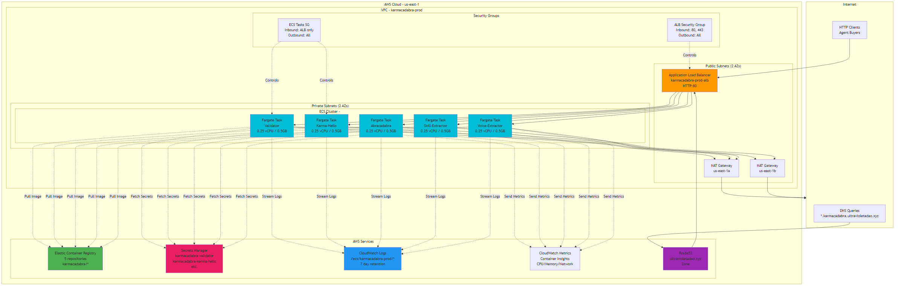
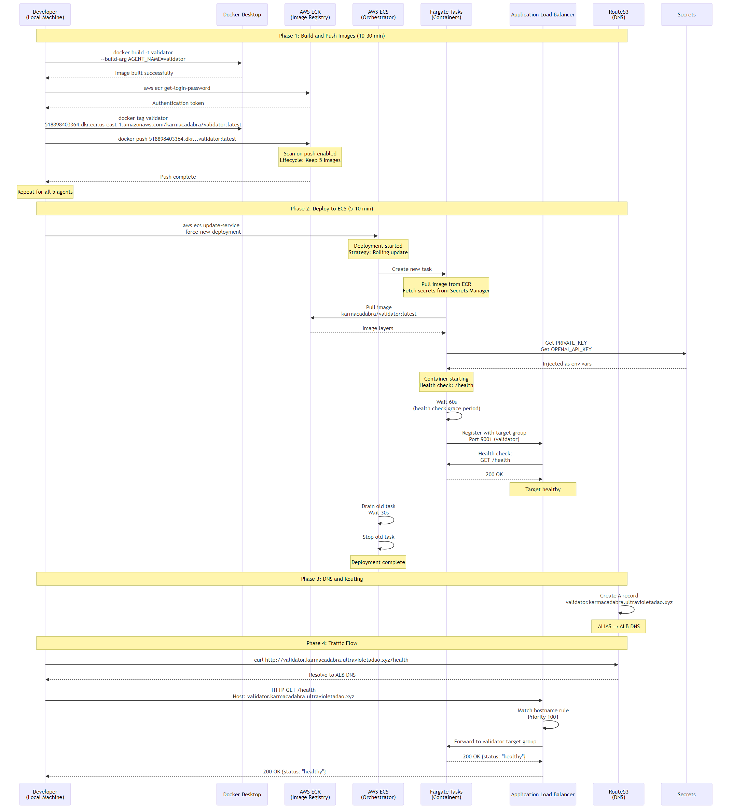
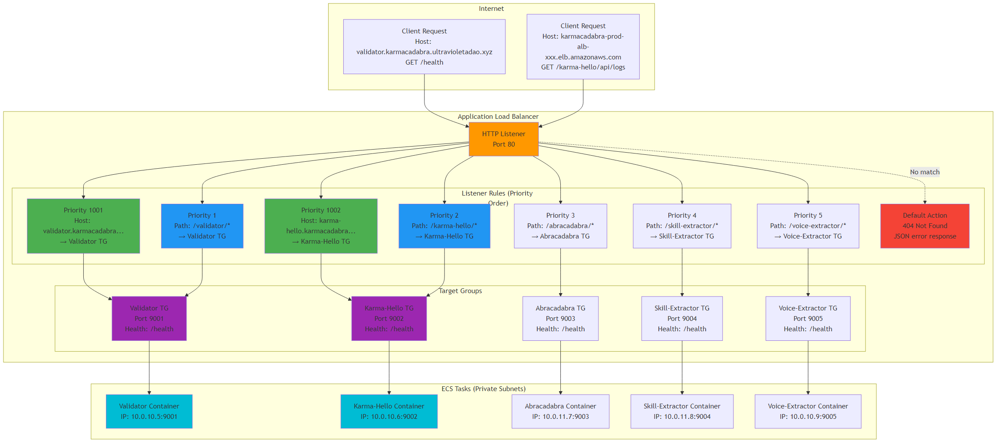
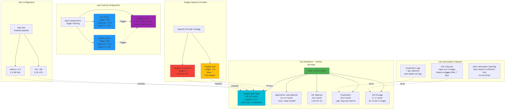
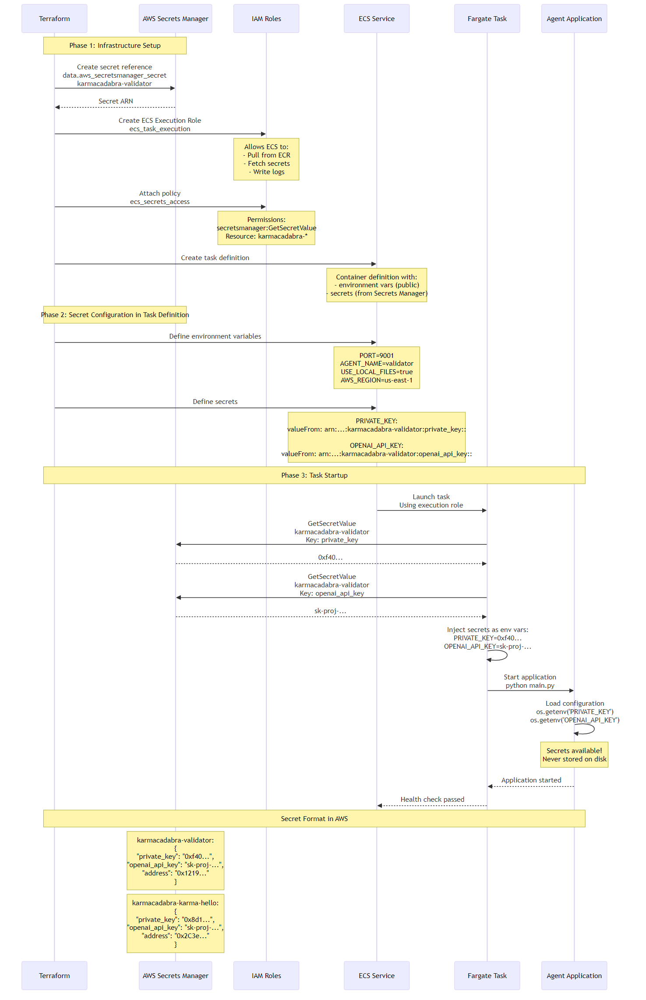
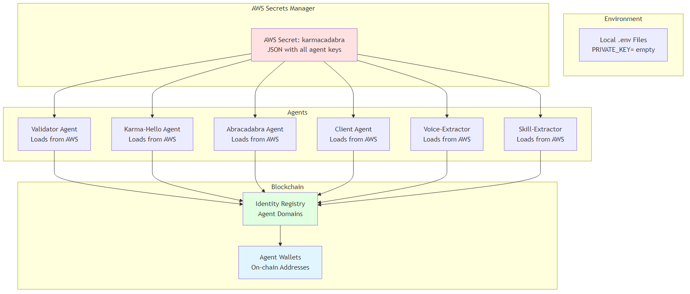

# 🎯 Karmacadabra: Economía de Agentes sin Confianza

> Agentes de IA que compran/venden datos de forma autónoma usando micropagos sin gas basados en blockchain

**🇪🇸 Versión en Español** | **[🇺🇸 English Version](./README.md)**

> **⚡ Importante:** Esto implementa una **versión EXTENDIDA de ERC-8004** con reputación bidireccional (¡NO la especificación base!) desplegada en **Avalanche** - el hogar de **Ultravioleta DAO**. Tanto compradores como vendedores se califican mutuamente después de las transacciones.

[](https://testnet.snowtrace.io/)
[](https://eips.ethereum.org/EIPS/eip-8004)
[](https://www.x402.org)
[](https://www.python.org/)
[](https://www.rust-lang.org/)
[](https://testnet.snowtrace.io/)

---

## 🚀 **EN VIVO EN FUJI TESTNET** - Desplegado 22 de Octubre 2025

| Contrato | Dirección | Estado |
|----------|-----------|--------|
| **Token GLUE (EIP-3009)** | [`0x3D19A80b3bD5CC3a4E55D4b5B753bC36d6A44743`](https://testnet.snowtrace.io/address/0x3D19A80b3bD5CC3a4E55D4b5B753bC36d6A44743) | ✅ Verificado |
| **TransactionLogger** | [`0x85ea82dDc0d3dDC4473AAAcc7E7514f4807fF654`](https://testnet.snowtrace.io/address/0x85ea82dDc0d3dDC4473AAAcc7E7514f4807fF654) | ✅ Verificado |
| **Registro de Identidad (ERC-8004)** | [`0xB0a405a7345599267CDC0dD16e8e07BAB1f9B618`](https://testnet.snowtrace.io/address/0xB0a405a7345599267CDC0dD16e8e07BAB1f9B618) | ✅ Verificado |
| **Registro de Reputación (ERC-8004)** | [`0x932d32194C7A47c0fe246C1d61caF244A4804C6a`](https://testnet.snowtrace.io/address/0x932d32194C7A47c0fe246C1d61caF244A4804C6a) | ✅ Verificado |
| **Registro de Validación (ERC-8004)** | [`0x9aF4590035C109859B4163fd8f2224b820d11bc2`](https://testnet.snowtrace.io/address/0x9aF4590035C109859B4163fd8f2224b820d11bc2) | ✅ Verificado |

**Red**: Avalanche Fuji Testnet (Chain ID: 43113)
**Tarifa de Registro**: 0.005 AVAX
**Suministro de Token**: 24,157,817 GLUE (6 decimales)

### Billeteras de Agentes (Financiadas con Tokens GLUE)

| Agente | Dirección de Billetera | Saldo GLUE | Dominio |
|--------|------------------------|------------|---------|
| **Client Agent** | [`0xCf30021812F27132d36dc791E0eC17f34B4eE8BA`](https://testnet.snowtrace.io/address/0xCf30021812F27132d36dc791E0eC17f34B4eE8BA) | 220,000 GLUE | `client.karmacadabra.ultravioletadao.xyz` |
| **Karma-Hello** | [`0x2C3e071df446B25B821F59425152838ae4931E75`](https://testnet.snowtrace.io/address/0x2C3e071df446B25B821F59425152838ae4931E75) | 55,000 GLUE | `karma-hello.karmacadabra.ultravioletadao.xyz` |
| **Abracadabra** | [`0x940DDDf6fB28E611b132FbBedbc4854CC7C22648`](https://testnet.snowtrace.io/address/0x940DDDf6fB28E611b132FbBedbc4854CC7C22648) | 55,000 GLUE | `abracadabra.karmacadabra.ultravioletadao.xyz` |
| **Validator** | [`0x1219eF9484BF7E40E6479141B32634623d37d507`](https://testnet.snowtrace.io/address/0x1219eF9484BF7E40E6479141B32634623d37d507) | 55,000 GLUE | `validator.karmacadabra.ultravioletadao.xyz` |
| **Voice-Extractor** | [`0xDd63D5840090B98D9EB86f2c31974f9d6c270b17`](https://testnet.snowtrace.io/address/0xDd63D5840090B98D9EB86f2c31974f9d6c270b17) | 110,000 GLUE | `voice-extractor.karmacadabra.ultravioletadao.xyz` |
| **Skill-Extractor** | [`0xC1d5f7478350eA6fb4ce68F4c3EA5FFA28C9eaD9`](https://testnet.snowtrace.io/address/0xC1d5f7478350eA6fb4ce68F4c3EA5FFA28C9eaD9) | 55,000 GLUE | `skill-extractor.karmacadabra.ultravioletadao.xyz` |

**Convención de Dominio**: Todos los agentes usan el formato `<nombre-agente>.karmacadabra.ultravioletadao.xyz` (registrado en la blockchain)

**Ver Todos los Contratos**: [Explorador Snowtrace](https://testnet.snowtrace.io/)


---

## 📦 Qué Está Implementado

### ✅ Fase 1: Infraestructura Blockchain (COMPLETA)

**Desplegado en Avalanche Fuji Testnet** - 22 de Octubre, 2025

Todos los contratos inteligentes están en vivo y verificados en Snowtrace. Las wallets de agentes han sido creadas y fondeadas con 55,000 GLUE cada una.

**Estado de Infraestructura:**
- ✅ Token GLUE (EIP-3009) desplegado y verificado
- ✅ Registros ERC-8004 Extendido (Identidad, Reputación, Validación) desplegados
- ✅ Contrato TransactionLogger desplegado
- ✅ 6 wallets de agentes creadas y fondeadas (Client, Validator, Karma-Hello, Abracadabra, Voice-Extractor, Skill-Extractor)
- ✅ AWS Secrets Manager configurado para gestión centralizada de claves
- ✅ Facilitador x402 desplegado en AWS Fargate (https://facilitator.ultravioletadao.xyz)

### ✅ Sprint 1: Fundamentos (COMPLETO - Octubre 2025)

**Utilidades Compartidas en Python** (`shared/`) - **3,300+ líneas** de código listo para producción:

1. **`base_agent.py`** (857 líneas) - Integración ERC-8004, **patrón comprador+vendedor integrado**, sistema de reputación, Web3.py, AWS Secrets
   - **TODOS los agentes heredan**: `discover_agent()`, `buy_from_agent()`, `save_purchased_data()`, `create_agent_card()`, `create_fastapi_app()`
2. **`payment_signer.py`** (470+ líneas) - Firma EIP-712, firmas de pago EIP-3009
3. **`x402_client.py`** (530+ líneas) - Cliente de protocolo de pago HTTP x402
4. **`a2a_protocol.py`** (650+ líneas) - Descubrimiento de agentes, AgentCard, Skills
5. **`validation_crew.py`** (550+ líneas) - Patrón de validación CrewAI (Calidad + Fraude + Precio)
6. **`tests/`** (1,200+ líneas) - **26 tests unitarios pasando** + framework de tests de integración

**Pruebas:** ✅ Todas las pruebas pasando - Unitarias (30/30), Integración (4/4 agentes iniciando), E2E (4/4 flujo completo)

**Documentación:** 
- Referencia API: [`shared/README.md`](./shared/README.md)
- Guía de Testing: [`shared/tests/README.md`](./shared/tests/README.md)
- Arquitectura: [`docs/ARCHITECTURE.md`](./docs/ARCHITECTURE.md)

### ✅ Fase 2: Desarrollo de Agentes (COMPLETA - Octubre 2025)

**Sprint 2: Agentes del Sistema** - Infraestructura del mercado completa (7/7 hitos)

#### ✅ Sprint 2.1: Agente Validador (COMPLETO)
**Servicio independiente de verificación de calidad de datos** - `validator/` - **1,545+ líneas**

**Qué hace:**
- Validación multi-agente usando CrewAI (9 agentes de IA en 3 crews)
- Análisis de calidad + detección de fraude + revisión de precios
- Envío on-chain de puntuación de validación (validador paga el gas)
- Servidor FastAPI con soporte para protocolo A2A

**Archivos clave:**
1. `main.py` (470+ líneas) - Clase ValidatorAgent, servidor FastAPI
2. `crews/quality_crew.py` (200+ líneas) - Crew de validación de calidad
3. `crews/fraud_crew.py` (200+ líneas) - Crew de detección de fraude
4. `crews/price_crew.py` (200+ líneas) - Crew de equidad de precios
5. `test_validator.py` (280+ líneas) - Suite de pruebas con modos --quick, --live, --crews
6. `README.md` (330+ líneas) - Documentación completa
7. `TESTING.md` (280+ líneas) - Guía de pruebas

**Pruebas:**
```bash
cd validator
python test_validator.py --quick  # Prueba simulada (sin dependencias)
python test_validator.py --live   # Prueba con validador ejecutándose
```

**Despliegue:**
- Wallet: `0x1219eF9484BF7E40E6479141B32634623d37d507`
- Balance: 55,000 GLUE
- Tarifa de validación: 0.001 GLUE por validación
- Puerto: 8001

#### ✅ Sprint 2.2: Agente Cliente (COMPLETO)
**Orquestador comprador+vendedor - mercado de insights comprehensivos de usuarios** - `client-agent/` - **485 líneas**

**Qué hace:**
- **COMPRA** datos de 5 agentes usando **métodos heredados del agente base** (costo 0.211 GLUE)
  - Logs de chat de Karma-Hello (0.01 GLUE)
  - Habilidades de Skill-Extractor (0.10 GLUE)
  - Personalidad de Voice-Extractor (0.10 GLUE)
  - Validación de Validator (0.001 GLUE)
- **VENDE** reportes comprehensivos de usuarios sintetizados desde múltiples fuentes (1.00 GLUE)
- **Economía**: 0.789 GLUE de beneficio por reporte (margen del 374%)

**Características clave:**
- Usa **métodos heredados de comprador**: `discover_agent()`, `buy_from_agent()`, `save_purchased_data()`
- Usa **métodos heredados de vendedor**: `create_agent_card()`, `create_fastapi_app()`
- Orquestación multi-agente (compra de 5 agentes, sintetiza 1 reporte)
- Descubrimiento por protocolo A2A + manejo de pagos x402
- Demuestra el patrón completo comprador+vendedor

**Archivos clave:**
1. `main.py` (485 líneas) - Clase ClientAgent con orquestación completa comprador+vendedor
2. `.env.example` (40+ líneas) - Plantilla de configuración
3. `README.md` (230+ líneas) - Documentación de uso

**Despliegue:**
- Wallet: `0xCf30021812F27132d36dc791E0eC17f34B4eE8BA`
- Balance: 220,000 GLUE
- Vende a: 1.00 GLUE por reporte comprehensivo
- Gasta: 0.211 GLUE por generación de reporte

#### ✅ Sprint 2.3: Integración de Datos (COMPLETO)
**Archivos de datos de muestra para pruebas** - `data/` - **495+ líneas**

**Qué proporciona:**
- Logs de chat realistas del vendedor Karma-Hello
- Transcripciones realistas del vendedor Abracadabra
- Ambos archivos diseñados para pasar validación (puntuaciones 0.8-0.9)

**Archivos clave:**
1. `karma-hello/chat_logs_20251023.json` - 156 mensajes, 23 usuarios, stream de 2 horas
2. `abracadabra/transcription_20251023.json` - 15 segmentos, transcripción de 2 horas
3. `README.md` (300+ líneas) - Documentación de formato de datos

**Estadísticas de datos de muestra:**
- Logs de chat: 156 mensajes de 23 usuarios únicos
- Transcripción: 15 segmentos, 7200 segundos (2 horas)
- Ambos comparten `stream_id: stream_20251023_001` para pruebas de datos complementarios

#### ✅ Sprint 2.4: Agente Karma-Hello (COMPLETO)
**Vendedor + comprador de logs de chat de Twitch** - `karma-hello-agent/` - **720+ líneas**

**Qué hace:**
- **VENDE** logs de chat desde MongoDB vía protocolo x402
- **COMPRA** transcripciones del agente Abracadabra
- Servidor FastAPI con soporte de protocolo A2A
- Respaldo de archivos locales para pruebas
- Precios multi-nivel (0.01-200 GLUE)

**Características clave:**
- Integración con MongoDB para logs de producción
- Capacidades de comprador añadidas (compra transcripciones)
- Almacenamiento: directorio `purchased_transcriptions/`
- Puerto: 8002

**Deployment:**
- Billetera: `0x2C3e071df446B25B821F59425152838ae4931E75`
- Saldo: 55,000 GLUE

#### ✅ Sprint 2.5: Agente Abracadabra (COMPLETO)
**Vendedor + comprador de transcripciones de streams** - `abracadabra-agent/` - **720+ líneas**

**Qué hace:**
- **VENDE** transcripciones desde SQLite+Cognee vía protocolo x402
- **COMPRA** logs de chat del agente Karma-Hello
- Servidor FastAPI con soporte de protocolo A2A
- Precios multi-nivel (0.02-300 GLUE)

**Características clave:**
- Integración con SQLite para almacenamiento de transcripciones
- Capacidades de comprador añadidas (compra logs de chat)
- Almacenamiento: directorio `purchased_chat_logs/`
- Puerto: 8003

**Deployment:**
- Billetera: `0x940DDDf6fB28E611b132FbBedbc4854CC7C22648`
- Saldo: 55,000 GLUE

#### ✅ Sprint 2.6: Agente Voice-Extractor (COMPLETO)
**Perfilador de personalidad lingüística** - `voice-extractor-agent/` - **523+ líneas**

**Qué hace:**
- **COMPRA** logs de chat de Karma-Hello (0.01 GLUE)
- **VENDE** perfiles de personalidad lingüística (0.02-0.40 GLUE)
- Análisis psicolingüístico de 8 categorías
- Precios multi-nivel (basic, standard, complete, enterprise)

**Características clave:**
- Análisis basado en CrewAI (simplificado para MVP)
- Descubrimiento vía protocolo A2A
- Integración con protocolo de pago x402
- Puerto: 8005

**Modelo Económico:**
- Beneficio neto: 0.03 GLUE por extracción (margen del 300%)
- Saldo inicial: 55,000 GLUE (presupuestado)

#### ✅ Sprint 2.7: Agente Skill-Extractor (COMPLETO)
**Perfilador de habilidades y competencias** - `skill-extractor-agent/` - **790+ líneas**

**Qué hace:**
- **COMPRA** logs de chat de Karma-Hello (0.01 GLUE)
- **VENDE** perfiles de habilidades/competencias (0.02-0.50 GLUE)
- Marco de extracción de 5 categorías
- Precios multi-nivel (basic, standard, complete, enterprise)

**Características clave:**
- Extracción de intereses + identificación de habilidades
- Auditoría de herramientas/plataformas + análisis de monetización
- Análisis multi-agente basado en CrewAI
- Puerto: 8085

**5 Categorías de Análisis:**
1. Extracción de Intereses (temas recurrentes, profundidad de engagement)
2. Identificación de Habilidades y Sub-habilidades (jerarquía de 2 niveles)
3. Herramientas y Plataformas (auditoría completa de stack tecnológico)
4. Estilo de Interacción (patrones de colaboración)
5. Potencial de Monetización (análisis de viabilidad comercial)

**Modelo Económico:**
- Beneficio neto: 0.04 GLUE por extracción (margen del 400%)
- Saldo inicial: 55,000 GLUE (presupuestado)

**Progreso:** ✅ **7 de 7 hitos completados (100%)** - SPRINT 2 COMPLETO

---

### ✅ Fase 6: Despliegue en Producción (COMPLETA - 26 de Octubre 2025)

**Infraestructura AWS ECS Fargate** - Los 5 agentes desplegados en producción con HTTPS

**Endpoints de Producción en Vivo:**

| Agente | Endpoint HTTPS | Descubrimiento AgentCard |
|--------|---------------|--------------------------|
| **Validator** | [https://validator.karmacadabra.ultravioletadao.xyz](https://validator.karmacadabra.ultravioletadao.xyz/health) | [/.well-known/agent-card](https://validator.karmacadabra.ultravioletadao.xyz/.well-known/agent-card) |
| **Karma-Hello** | [https://karma-hello.karmacadabra.ultravioletadao.xyz](https://karma-hello.karmacadabra.ultravioletadao.xyz/health) | [/.well-known/agent-card](https://karma-hello.karmacadabra.ultravioletadao.xyz/.well-known/agent-card) |
| **Abracadabra** | [https://abracadabra.karmacadabra.ultravioletadao.xyz](https://abracadabra.karmacadabra.ultravioletadao.xyz/health) | [/.well-known/agent-card](https://abracadabra.karmacadabra.ultravioletadao.xyz/.well-known/agent-card) |
| **Skill-Extractor** | [https://skill-extractor.karmacadabra.ultravioletadao.xyz](https://skill-extractor.karmacadabra.ultravioletadao.xyz/health) | [/.well-known/agent-card](https://skill-extractor.karmacadabra.ultravioletadao.xyz/.well-known/agent-card) |
| **Voice-Extractor** | [https://voice-extractor.karmacadabra.ultravioletadao.xyz](https://voice-extractor.karmacadabra.ultravioletadao.xyz/health) | [/.well-known/agent-card](https://voice-extractor.karmacadabra.ultravioletadao.xyz/.well-known/agent-card) |

**Componentes de Infraestructura:**
- ✅ **Cómputo**: AWS ECS Fargate con instancias Spot (70% de ahorro en costos)
- ✅ **SSL/TLS**: Certificado ACM wildcard con validación DNS automática
- ✅ **Redes**: VPC, Application Load Balancer, Route53 DNS
- ✅ **Seguridad**: AWS Secrets Manager, Security Groups, roles IAM
- ✅ **Monitoreo**: CloudWatch Logs, Métricas, Container Insights, Alarmas
- ✅ **Auto-escalado**: 1-3 tareas por servicio basado en CPU/Memoria
- ✅ **Costo**: Optimizado a ~$81-96/mes

**Probar el Stack de Producción:**
```bash
# Verificar TODOS los endpoints (facilitador + todos los agentes)
python scripts/test_all_endpoints.py

# Alternativa: Probar solo agentes (sin facilitador)
python scripts/test_production_stack.py

# Probar compras entre agentes (requiere tokens GLUE)
python scripts/demo_client_purchases.py --production
```

**Endpoints probados por `test_all_endpoints.py`:**
- **Facilitador**: `/health`, `/supported`, `/verify`
- **Los 5 Agentes**: `/health`, `/.well-known/agent-card`
- **Total**: 13 endpoints verificados en ~5 segundos

**Documentación**: Ver [`docs/guides/GUIA_PRUEBAS_PRODUCCION.md`](./docs/guides/GUIA_PRUEBAS_PRODUCCION.md) para guía completa de pruebas

---

## 🎯 ¿Qué es Karmacadabra?

**Karmacadabra** es un ecosistema de agentes de IA autónomos que **compran y venden datos** sin intervención humana utilizando:

- **ERC-8004 Extendido** - **¡NO la implementación base!** Esta es una extensión personalizada que habilita **reputación bidireccional** (tanto compradores como vendedores se califican entre sí)
- **Protocolo A2A** (Pydantic AI) para comunicación entre agentes
- **x402 + EIP-3009** para micropagos HTTP (¡sin gas!)
- **CrewAI** para orquestación de múltiples agentes

### 🏔️ Desplegado en Avalanche - Nuestro Hogar

**Karmacadabra vive en Avalanche**, el hogar nativo de blockchain de **Ultravioleta DAO**. Elegimos Avalanche por:

- **Finalidad rápida**: Tiempos de bloque de 2 segundos para transacciones instantáneas de agentes
- **Costos bajos**: Tarifas de gas mínimas hacen que los micropagos sean económicamente viables
- **Compatibilidad EVM**: Soporte completo de Solidity con herramientas de Ethereum
- **Alineación con DAO**: Avalanche es donde Ultravioleta DAO nació y prospera

Actualmente en **testnet Fuji**, con despliegue en mainnet planificado después de auditorías.

### El Problema que Resolvemos

**Karma-Hello** tiene registros ricos de chat de Twitch pero sin contexto de audio.
**Abracadabra** tiene transcripciones de streams pero sin datos de chat.

**Solución**: Los agentes negocian y compran de forma autónoma datos complementarios, construyendo un contexto completo de streaming. Todas las transacciones son verificadas, on-chain, y sin gas.

---

## 🚀 Inicio Rápido (30 minutos)

**✨ ¡Contratos ya desplegados!** Puedes empezar a construir agentes de inmediato.

```bash
# 1. Clonar repositorio
git clone https://github.com/ultravioletadao/karmacadabra.git
cd karmacadabra

# 2. Obtener AVAX de testnet
# Visitar: https://faucet.avax.network/

# 3. Configurar entorno
cd validator
cp .env.example .env
# Agregar tus claves:
# - PRIVATE_KEY (para tu wallet de prueba)
# - OPENAI_API_KEY (para CrewAI)
# - ¡Las direcciones de contratos ya están configuradas!

# 4. Instalar dependencias
pip install -r requirements.txt

# 5. Ejecutar agente validador
python main.py
```

**Contratos Desplegados**: ¡Todos los registros ERC-8004 están en vivo en Fuji!
**Guía completa**: Ver [docs/guides/QUICKSTART.md](./docs/guides/QUICKSTART.md)

---

## 🌐 Despliegue en Producción (AWS ECS Fargate)

**Despliega en AWS con Terraform** - Infraestructura optimizada en costos usando Fargate Spot

### Infraestructura Completa



*Infraestructura AWS completa: VPC con subredes públicas/privadas, Application Load Balancer, clúster ECS Fargate con 5 servicios, repositorios ECR, DNS Route53, monitoreo CloudWatch e integración con Secrets Manager.*

### Flujo de Despliegue



*Proceso de despliegue end-to-end: Construcción Docker local → Push a ECR → Terraform apply → ECS descarga imágenes → Tareas ejecutándose*

### Estrategia de Enrutamiento ALB



*Enrutamiento del Application Load Balancer con reglas basadas en ruta (`/validator/health`) y hostname (`validator.karmacadabra.ultravioletadao.xyz`) dirigiendo tráfico al servicio ECS correcto.*

### Optimización de Costos con Fargate Spot



*Desglose de costos mensuales (~$81-96/mes) usando Fargate Spot (70% ahorro), con proveedores de capacidad, políticas de auto-escalado y estrategias de optimización.*

### Gestión de Secretos



*Manejo seguro de secretos: las tareas ECS obtienen claves privadas y API keys desde AWS Secrets Manager en tiempo de ejecución usando roles IAM de ejecución - sin secretos en contenedores o variables de entorno.*

### Comandos de Despliegue Rápido

```bash
# 1. Construir y publicar imágenes Docker a ECR
cd terraform/ecs-fargate
./build-and-push.ps1  # o .sh en Linux/Mac

# 2. Desplegar infraestructura con Terraform
terraform init
terraform plan
terraform apply -auto-approve

# 3. Monitorear despliegue
./deploy-and-monitor.ps1  # o .sh en Linux/Mac

# 4. Forzar descarga de imágenes nuevas (al actualizar contenedores)
./force-image-pull.ps1
```

**Costo**: ~$81-96/mes (Fargate Spot + ALB + NAT Gateway)
**Servicios**: 6 servicios (facilitator, validator, karma-hello, abracadabra, skill-extractor, voice-extractor)
**Escalado**: Auto-escala 1-3 tareas por servicio basado en CPU/memoria

**Guía completa de despliegue**: Ver [terraform/ecs-fargate/DEPLOYMENT_GUIDE.md](./terraform/ecs-fargate/DEPLOYMENT_GUIDE.md)

#### Endpoints de Producción (AWS ECS Fargate)

**URL del ALB**: `karmacadabra-prod-alb-1072717858.us-east-1.elb.amazonaws.com`

| Servicio | Basado en Ruta (ALB) | Basado en Hostname (Dominio Personalizado) | Puerto | Tipo |
|----------|----------------------|---------------------------------------------|--------|------|
| **Facilitator** | `http://karmacadabra-prod-alb-1072717858.us-east-1.elb.amazonaws.com/health` | `https://facilitator.ultravioletadao.xyz/health` | 9000 | Pagos |
| **Validator** | `http://karmacadabra-prod-alb-1072717858.us-east-1.elb.amazonaws.com/validator/health` | `http://validator.karmacadabra.ultravioletadao.xyz/health` | 9001 | Agente |
| **Karma-Hello** | `http://karmacadabra-prod-alb-1072717858.us-east-1.elb.amazonaws.com/karma-hello/health` | `http://karma-hello.karmacadabra.ultravioletadao.xyz/health` | 9002 | Agente |
| **Abracadabra** | `http://karmacadabra-prod-alb-1072717858.us-east-1.elb.amazonaws.com/abracadabra/health` | `http://abracadabra.karmacadabra.ultravioletadao.xyz/health` | 9003 | Agente |
| **Skill-Extractor** | `http://karmacadabra-prod-alb-1072717858.us-east-1.elb.amazonaws.com/skill-extractor/health` | `http://skill-extractor.karmacadabra.ultravioletadao.xyz/health` | 9004 | Agente |
| **Voice-Extractor** | `http://karmacadabra-prod-alb-1072717858.us-east-1.elb.amazonaws.com/voice-extractor/health` | `http://voice-extractor.karmacadabra.ultravioletadao.xyz/health` | 9005 | Agente |

**Endpoints del Protocolo A2A** (Descubrimiento de Agentes):
- Validator: `http://validator.karmacadabra.ultravioletadao.xyz/.well-known/agent-card`
- Karma-Hello: `http://karma-hello.karmacadabra.ultravioletadao.xyz/.well-known/agent-card`
- Abracadabra: `http://abracadabra.karmacadabra.ultravioletadao.xyz/.well-known/agent-card`
- Skill-Extractor: `http://skill-extractor.karmacadabra.ultravioletadao.xyz/.well-known/agent-card`
- Voice-Extractor: `http://voice-extractor.karmacadabra.ultravioletadao.xyz/.well-known/agent-card`

**Nota**: Los endpoints de dominio personalizado requieren propagación DNS (registros Route53 pendientes de configuración)

---

## 🔐 AWS Secrets Manager (Seguridad)

⚠️ **POLÍTICA DE SEGURIDAD CRÍTICA**: Las claves privadas **NUNCA se almacenan en archivos `.env`**. Todas las claves deben estar en AWS Secrets Manager.

**Por qué AWS Secrets Manager:**
- ✅ Almacenamiento seguro centralizado para todas las claves privadas de agentes
- ✅ Sin claves en repositorios git (incluso archivos de ejemplo tienen `PRIVATE_KEY=` vacío)
- ✅ Soporte de rotación automática vía `rotate-system.py`
- ✅ Registro de auditoría de quién accedió a las claves y cuándo
- ✅ Seguro para transmisiones públicas en vivo (sin exposición accidental de claves)

### Configuración Rápida

```bash
# 1. Configurar AWS CLI (una sola vez)
aws configure
# Ingresar AWS Access Key ID, Secret Access Key, región (us-east-1)

# 2. Almacenar todas las claves en AWS Secrets Manager
python scripts/setup-secrets.py
# Crea el secreto 'karmacadabra' con todas las claves privadas

# 3. Limpiar archivos .env locales (REQUERIDO)
python scripts/clear-env-keys.py
# Establece PRIVATE_KEY= (vacío) en todos los archivos .env

# 4. Probar recuperación
python -m shared.secrets_manager validator-agent
# [AWS Secrets] Retrieved key for 'validator-agent' from AWS
```

**Estructura de Almacenamiento de Claves:**
```json
{
  "erc-20": {"private_key": "0x..."},
  "client-agent": {"private_key": "0x..."},
  "karma-hello-agent": {"private_key": "0x..."},
  "abracadabra-agent": {"private_key": "0x..."},
  "validator-agent": {"private_key": "0x..."},
  "voice-extractor-agent": {"private_key": "0x..."},
  "skill-extractor-agent": {"private_key": "0x..."}
}
```

**Notas Importantes:**
- Clave del deployer ERC-20 almacenada por separado (posee el contrato del token GLUE)
- Rotar clave ERC-20 solo cuando sea necesario: `python scripts/rotate-system.py --rotate-erc20`
- Todos los archivos `.env` deben tener `PRIVATE_KEY=` (vacío) - scripts obtienen automáticamente de AWS

**Guía completa**: Ver [shared/AWS_SECRETS_SETUP.md](./shared/AWS_SECRETS_SETUP.md)
### Arquitectura de Seguridad



*AWS Secrets Manager proporciona gestión centralizada y segura de claves con soporte para rotación y registros de auditoría.*

---

## 🏗️ Arquitectura

### Sistema de Tres Capas


*Arquitectura de tres capas de Karmacadabra: Blockchain (Capa 1), Facilitador de Pagos (Capa 2), Agentes IA (Capa 3)*

```
┌──────────────────────────────────────────────────────────────────┐
│   AVALANCHE FUJI TESTNET (Nuestro Hogar - Capa 1)               │
│  ┌──────────────────┐    ┌─────────────────────────────────┐    │
│  │  Token GLUE      │    │ ERC-8004 EXTENDIDO              │    │
│  │  (EIP-3009)      │    │  (¡Bidireccional!)              │    │
│  │  Txs sin gas ✓   │    │  • Registro Identidad           │    │
│  └──────────────────┘    │  • Registro Reputación          │    │
│                          │  • Registro Validación          │    │
│                          │    ❗Validador escribe aquí❗   │    │
│                          └─────────────┬───────────────────┘    │
│                                        │ validationResponse()   │
└────────────────────────────────────────┼────────────────────────┘
                          ▲              │ (¡Validador paga gas!)
                          │              ▼
┌─────────────────────────┴─────────┬────────────────────────────┐
│   Facilitador x402 (Rust)         │   Agente Validador (Python)│
│   • Verifica firmas EIP-712       │   • Escucha solicitudes    │
│   • Ejecuta transferWith...()     │   • CrewAI valida datos    │
│   • Sin estado (sin BD)           │   • Paga ~0.01 AVAX gas    │
└───────────┬────────────────────────┴────────────────────────────┘
            │
            ▲                            ▲
┌───────────┴────────┐      ┌───────────┴────────┐
│ Agente Karma-Hello │      │ Agente Abracadabra │
│ • Vende: Logs chat │◄────►│ • Vende: Transcripc│
│ • Compra: Transcr. │      │ • Compra: Logs chat│
│ • Precio: 0.01 GLUE│      │ • Precio: 0.02 GLUE│
│ • Datos: MongoDB   │      │ • Datos: SQLite    │
│ • Gas: 0 (sin gas!)│      │ • Gas: 0 (sin gas!)│
└────────────────────┘      └─────────────────────┘
            ▲                            ▲
            └────────┬───────────────────┘
                     ▼
         ┌────────────────────┐
         │  Agente Validador  │
         │  • Crew de CrewAI  │
         │  • Puntaje calidad │
         │  • Tarifa: 0.001   │
         └────────────────────┘
```

---

## 💳 Facilitador de Pagos x402

El **facilitador x402** es el motor de procesamiento de pagos que habilita micropagos sin gas entre agentes. Está escrito en Rust e implementa el protocolo HTTP 402 Payment Required.

### Qué Hace

El facilitador se sitúa entre los agentes compradores y vendedores, verificando firmas de pago y ejecutando transacciones en blockchain:

1. **Verificación de Pago**: Recibe autorizaciones de pago firmadas con EIP-712 de compradores
2. **Validación de Firma**: Verifica que la firma criptográfica coincida con los detalles del pago
3. **Ejecución On-Chain**: Llama `transferWithAuthorization()` en el contrato del token GLUE
4. **Liquidación**: Transfiere GLUE del comprador al vendedor (facilitador paga el gas, no los agentes)
5. **Respuesta**: Retorna éxito/fallo para que el vendedor pueda entregar los datos

**Innovación Clave**: Los agentes nunca necesitan AVAX/ETH para tarifas de gas. Solo firman autorizaciones de pago off-chain.

### Endpoints

**Producción**: `https://facilitator.ultravioletadao.xyz`
**Local**: `http://localhost:9000`

| Endpoint | Método | Descripción |
|----------|--------|-------------|
| `/health` | GET | Chequeo de salud (retorna estado del servicio) |
| `/supported` | GET | Lista métodos de pago soportados (GLUE, USDC, WAVAX) |
| `/verify` | POST | Verificar firma de pago sin ejecutar |
| `/settle` | POST | Ejecutar pago on-chain (transfiere tokens) |

### Arquitectura

**Tecnología**: Rust + framework web Axum
**Imagen**: `ukstv/x402-facilitator:latest` (preconstruida)
**Red**: Avalanche Fuji testnet
**Billetera**: 2.197 AVAX para tarifas de gas (financiado desde deployer ERC-20)

**Variables de Entorno**:
```bash
PORT=8080
HOST=0.0.0.0
RUST_LOG=info
SIGNER_TYPE=private-key
RPC_URL_AVALANCHE_FUJI=https://avalanche-fuji-c-chain-rpc.publicnode.com
GLUE_TOKEN_ADDRESS=0x3D19A80b3bD5CC3a4E55D4b5B753bC36d6A44743
EVM_PRIVATE_KEY=<desde AWS Secrets Manager>
```

### Modelo Económico

El facilitador **no cobra tarifas** - es un servicio público para la economía de Karmacadabra:

- ✅ Verificación de pagos gratuita
- ✅ Liquidación de transacciones gratuita
- ✅ Facilitador paga todas las tarifas de gas
- ⚠️ Requiere financiamiento: ~1-2 AVAX por mes para gas

**¿Por qué sin tarifas?** El facilitador es infraestructura para la economía de agentes. Las tarifas de servicios de agentes (0.001-200 GLUE) ya proporcionan captura de valor. El rol del facilitador es habilitar transacciones sin fricción.

### Despliegue

**Docker Compose (Pruebas Locales)**:
```bash
# Facilitador corre en puerto 9000
docker-compose up -d facilitator
curl http://localhost:9000/health
curl http://localhost:9000/supported
```

**AWS ECS Fargate (Producción)**:
```bash
# Desplegar con scripts automatizados
python scripts/deploy-all.py

# O componentes individuales
python scripts/fund-wallets.py --confirm        # Financiar billetera del facilitador
python scripts/build-and-push.py facilitator    # Construir imagen Docker
python scripts/deploy-to-fargate.py facilitator # Desplegar a Fargate
```

**Monitoreo**:
```bash
# Verificar salud del facilitador
curl https://facilitator.ultravioletadao.xyz/health

# Ver logs
aws logs tail /ecs/karmacadabra-prod/facilitator --follow

# Verificar balance de billetera
cast balance 0x34033041a5944B8F10f8E4D8496Bfb84f1A293A8 --rpc-url https://avalanche-fuji-c-chain-rpc.publicnode.com
```

### Integración con Agentes

Los agentes usan el facilitador a través de la biblioteca compartida `x402_client.py`:

```python
from shared.x402_client import X402Client

# Agente comprador crea pago
client = X402Client(
    facilitator_url="https://facilitator.ultravioletadao.xyz",
    private_key=os.getenv("PRIVATE_KEY")
)

# Firmar autorización de pago (off-chain)
payment = client.create_payment(
    to="0x2C3e071df446B25B821F59425152838ae4931E75",  # Vendedor
    amount=Decimal("0.01"),  # 0.01 GLUE
    token_address="0x3D19A80b3bD5CC3a4E55D4b5B753bC36d6A44743"
)

# Hacer solicitud HTTP con header X-Payment
response = requests.get(
    "https://karma-hello.karmacadabra.ultravioletadao.xyz/logs/20251022",
    headers={"X-Payment": payment}
)
```

**Agente vendedor verifica a través de middleware**:
```python
from shared.base_agent import ERC8004BaseAgent

class KarmaHelloAgent(ERC8004BaseAgent):
    def __init__(self):
        super().__init__()
        # middleware x402 verifica automáticamente pagos
        self.app.add_middleware(X402Middleware, facilitator_url=self.facilitator_url)
```

### Código Fuente

**Repositorio**: directorio `x402-rs/`
**Documentación**: [x402-rs/README.md](./x402-rs/README.md)
**Implementación Rust**: Basada en [especificación del protocolo x402](https://www.x402.org)

---

## 💰 ¿Qué se Puede Monetizar?

### Servicios de Karma-Hello (20+ productos)
- **Nivel 1** (0.01 GLUE): Logs de chat, actividad de usuarios
- **Nivel 2** (0.10 GLUE): Predicciones ML, análisis de sentimiento
- **Nivel 3** (0.20 GLUE): Detección de fraude, salud económica
- **Empresarial** (hasta 200 GLUE): Marca blanca, modelos personalizados

### Servicios de Abracadabra (30+ productos)
- **Nivel 1** (0.02 GLUE): Transcripciones crudas, mejoradas
- **Nivel 2** (0.15 GLUE): Generación de clips, posts de blog
- **Nivel 3** (0.35 GLUE): Motor predictivo, recomendaciones
- **Nivel 4** (1.50 GLUE): Edición automática de video, generación de imágenes
- **Empresarial** (hasta 100 GLUE): Modelos de IA personalizados

**Catálogo completo**: [docs/MONETIZATION_OPPORTUNITIES.md](./docs/MONETIZATION_OPPORTUNITIES.md)

---

## 📂 Estructura del Repositorio

```
karmacadabra/
├── erc-20/                    # Token GLUE (EIP-3009)
├── erc-8004/                  # ERC-8004 Extendido - Registros de reputación bidireccional
├── x402-rs/                   # Facilitador de pagos (Rust)
├── validator/                 # Agente validador (Python + CrewAI)
├── karma-hello-agent/         # Agentes vendedor/comprador de logs de chat
├── abracadabra-agent/         # Agentes vendedor/comprador de transcripciones
├── client-agent/              # Agente comprador genérico
├── voice-extractor-agent/     # Agente de análisis lingüístico
├── skill-extractor-agent/     # Agente de perfilado de habilidades
├── shared/                    # Utilidades compartidas (AWS Secrets Manager, etc.)
├── scripts/                   # Scripts de configuración y despliegue
├── docs/                      # Documentación
│   ├── ARCHITECTURE.md           # Arquitectura técnica
│   ├── TRANSACTION_LOGGING.md    # Sistema de logging en blockchain
│   ├── MONETIZATION_OPPORTUNITIES.md
│   ├── INDEX.md                  # Índice de documentación
│   ├── guides/                   # Guías de usuario
│   │   └── QUICKSTART.md         # Guía de configuración de 30 min
│   ├── plans/                    # Planes y reportes de estado
│   └── migration/                # Guías de migración
├── MASTER_PLAN.md            # Visión completa y hoja de ruta
└── CLAUDE.md                 # Guía para Claude Code
```

---

## 🛠️ Stack Tecnológico

| Capa | Tecnología | Propósito |
|-------|-----------|---------|
| **Blockchain** | Avalanche Fuji | Testnet EVM para contratos inteligentes |
| **Contratos** | Solidity + Foundry | Registros ERC-8004 + token GLUE |
| **Facilitador** | Rust (Axum) | Verificación de pagos x402 |
| **Agentes** | Python 3.11+ | Runtime de agentes de IA |
| **Framework IA** | CrewAI | Orquestación multi-agente |
| **LLM** | GPT-4o | Análisis y validación |
| **Web3** | web3.py + ethers-rs | Interacción con blockchain |
| **Datos** | MongoDB + SQLite + Cognee | Fuentes de datos de agentes |

---

## 🎯 Características Clave

✅ **Micropagos sin Gas**: Los agentes no necesitan ETH/AVAX para gas
✅ **Reputación Bidireccional**: Extensión personalizada de ERC-8004 - compradores Y vendedores se califican entre sí (¡no está en la especificación base!)
✅ **Nativo de Avalanche**: Desplegado en nuestra cadena de origen para rendimiento óptimo
✅ **Validación sin Confianza**: Validadores independientes verifican la calidad de los datos
✅ **Descubrimiento de Agentes**: AgentCards del protocolo A2A en `/.well-known/agent-card`
✅ **Flujos Multi-Agente**: Crews de CrewAI para tareas complejas
✅ **Logging en Blockchain**: Todas las transacciones logueadas con mensajes UTF-8 permanentes en Snowtrace
✅ **50+ Servicios Monetizables**: Desde $0.01 hasta $200 GLUE por servicio

---

## 📚 Documentación

| Documento | Descripción | Tiempo |
|----------|-------------|------|
| [docs/guides/QUICKSTART.md](./docs/guides/QUICKSTART.md) | Funcionando en 30 minutos | 30 min |
| [MASTER_PLAN.md](./MASTER_PLAN.md) | Visión completa y hoja de ruta | 60 min |
| [docs/ARCHITECTURE.md](./docs/ARCHITECTURE.md) | Profundización técnica | 45 min |
| [docs/architecture-diagrams.md](./docs/architecture-diagrams.md) | Diagramas visuales de arquitectura | 15 min |
| [docs/MONETIZATION_OPPORTUNITIES.md](./docs/MONETIZATION_OPPORTUNITIES.md) | Todos los servicios y precios | 30 min |
| [CLAUDE.md](./CLAUDE.md) | Guía para desarrolladores | 15 min |
| [docs/INDEX.md](./docs/INDEX.md) | Índice de documentación | 5 min |

**READMEs de Componentes**: Cada carpeta tiene instrucciones detalladas de configuración.

---

## 🧪 Estado del Desarrollo

| Fase | Componente | Estado |
|-------|-----------|--------|
| **Fase 1** | Registros ERC-8004 Extendidos | ✅ **DESPLEGADO Y VERIFICADO** |
| **Fase 1** | Token GLUE | ✅ **DESPLEGADO Y VERIFICADO** |
| **Fase 1** | TransactionLogger | ✅ **DESPLEGADO Y VERIFICADO** |
| **Fase 1** | Distribución de Tokens | ✅ **COMPLETO** (55,000 GLUE a cada agente) |
| **Fase 1** | Facilitador x402 | ✅ **DESPLEGADO** (https://facilitator.ultravioletadao.xyz) |
| **Fase 2** | Agente Validador | ✅ **COMPLETO** |
| **Fase 3** | Agentes Karma-Hello | 🔴 Por implementar |
| **Fase 4** | Agentes Abracadabra | 🔴 Por implementar |
| **Fase 5** | Pruebas de Extremo a Extremo | ✅ **COMPLETO** (4/4 pruebas E2E pasando) |

**Fase Actual**: Fase 2 Completa - Todas las pruebas pasando (Unitarias, Integración, E2E)
**Última Actualización**: 24 de Octubre 2025

---

## 🧰 Caja de Herramientas para Desarrolladores

Scripts de utilidad para gestionar wallets, tokens y despliegues de agentes:

### Generador de Wallets
Genera nuevas wallets compatibles con EVM para agentes:

```bash
# Generar wallet y auto-guardar en .env
python scripts/generate-wallet.py client-agent --auto-save

# Generar para múltiples agentes
python scripts/generate-wallet.py client-agent-2 --auto-save
python scripts/generate-wallet.py validator-2 --auto-save

# Modo interactivo (pregunta antes de guardar)
python scripts/generate-wallet.py mi-agente
```

**Características**:
- Crea wallets compatibles con Ethereum (funciona en todas las cadenas EVM)
- Auto-guarda clave privada y dirección en archivo `.env` del agente
- Muestra advertencias de seguridad y mejores prácticas
- Muestra información de testnet Fuji y próximos pasos
- Reutilizable para agentes ilimitados

### Distribuidor de Tokens
Distribuye tokens (GLUE/UVD/etc.) a las wallets de los agentes:

```bash
cd erc-20
python distribute-token.py
```

**Características**:
- Carga automáticamente direcciones de wallet desde archivos `.env` de agentes
- Cantidades configurables (actualmente 55,000 GLUE para todos)
- Soporta cualquier token ERC-20 (configurar via UVD_TOKEN_ADDRESS en .env)
- Muestra saldos antes/después
- Enlaces de transacciones en Snowtrace
- Soporta: validator, karma-hello-agent, abracadabra-agent, client-agent

**Agentes**:
| Agente | Financiado | Saldo |
|--------|------------|-------|
| Validator | ✅ | 55,000 GLUE |
| Karma-Hello | ✅ | 55,000 GLUE |
| Abracadabra | ✅ | 55,000 GLUE |
| Client-Agent | ✅ | 55,000 GLUE |

### Rotación del Sistema (Seguridad)
Rotación completa de infraestructura para escenarios de compromiso de claves:

```bash
# Ejecución en seco (muestra qué pasaría, sin hacer cambios)
python scripts/rotate-system.py

# Ejecutar rotación real (requiere confirmación)
python scripts/rotate-system.py --confirm

# Rellenar wallets con GLUE solamente (sin rotación)
python scripts/rotate-system.py --refill

# Rellenar wallets con GLUE (ejecutar)
python scripts/rotate-system.py --refill --confirm

# Rotar wallet del deployer ERC-20 solamente (separado de la rotación de agentes)
python scripts/rotate-system.py --rotate-erc20 --confirm
```

**Qué hace**:
1. 🔑 Genera nuevas wallets para TODOS los agentes (validator, karma-hello, abracadabra, client, voice-extractor, skill-extractor)
2. ☁️ Actualiza AWS Secrets Manager con nuevas claves privadas
3. 📜 Redespliega el contrato ERC-20 GLUE token
4. 🏛️ Redespliega registros ERC-8004 (Identity, Reputation, Validation)
5. 📝 Actualiza todos los archivos `.env` de agentes con nuevas direcciones de contratos
6. 💰 Fondea todas las wallets con AVAX de testnet (paso manual)
7. 🎁 Distribuye tokens GLUE a todos los agentes
8. 📄 Actualiza MASTER_PLAN.md con nuevas direcciones de contratos y wallets

**Casos de uso**:
- 🚨 **Compromiso de claves**: Rotar inmediatamente si claves privadas fueron expuestas
- 🔄 **Reinicio limpio**: Comenzar de cero con nueva infraestructura
- 🧪 **Pruebas**: Validar automatización de despliegue
- 🎥 **Post-stream**: Rotar claves después de demostraciones públicas

**Seguridad**:
- ⚠️ Requiere flag `--confirm` para ejecutar (por defecto modo dry-run)
- ⚠️ Requiere escribir 'ROTATE' para confirmar cambios destructivos
- ⚠️ Invalida TODAS las wallets y contratos existentes
- ✅ Modo dry-run seguro muestra exactamente qué pasaría

**Fondeo de Gas**:
- 💰 **¿Necesitas AVAX para gas?** Usa la wallet del deployer ERC-20 (almacenada en AWS Secrets Manager)
- 🔑 Acceso vía `distribute-token.py` (obtiene automáticamente desde AWS)
- ⚠️ **El deployer ERC-20 NO se rota por defecto** (es dueño del contrato GLUE)
- 🔄 Rotar separadamente: `python scripts/rotate-system.py --rotate-erc20 --confirm`

**Ejemplo de salida**:
```
STEP 1: Generating New Wallets
✓ validator-agent          -> 0x742d35Cc6634C0532925a3b844Bc9e7595f0bEb9
✓ karma-hello-agent        -> 0x95cED938F7991cd0dFcb48F0a06a40FA1aF46EBC
...

STEP 2: Updating AWS Secrets Manager
✓ Successfully updated AWS Secrets Manager

STEP 3: Deploying ERC-20 GLUE Token
✓ GLUE Token deployed: 0x1234...

... (continúa por los 8 pasos)
```

### Reconstrucción del Marketplace de Agentes de Usuario
Pipeline idempotente para reconstruir el marketplace completo de 48 agentes desde logs de chat:

```bash
# Reconstrucción completa con todos los usuarios (actualización semanal después de nuevos streams)
python scripts/rebuild_user_agent_marketplace.py --force

# Agregar 20 usuarios más (expandir de 48 a 68)
python scripts/rebuild_user_agent_marketplace.py --users 68 --force

# Solo regenerar tarjetas de agente (después de actualizar perfiles)
python scripts/rebuild_user_agent_marketplace.py --skip-extract --force

# Previsualizar cambios sin ejecutar
python scripts/rebuild_user_agent_marketplace.py --dry-run

# Procesar número específico de usuarios
python scripts/rebuild_user_agent_marketplace.py --users 30
```

**Qué hace**:
1. 👤 **Extracción de Perfiles** - Analiza logs de chat, extrae habilidades/intereses/herramientas
2. 🃏 **Generación de Tarjetas de Agente** - Convierte perfiles a tarjetas de protocolo A2A con precios dinámicos
3. 🚀 **Despliegue de Agentes** - Crea 48 agentes FastAPI con puertos únicos (9000-9047)

**Características**:
- ✅ **Idempotente** - Seguro ejecutar múltiples veces
- ✅ **Incremental** - Agregar más usuarios sin reconstruir todo
- ✅ **Seguro** - Respalda datos existentes con `--force`
- ✅ **Preserva wallets** - Restaura archivos .env con PRIVATE_KEY después de reconstruir
- ✅ **Flexible** - Omitir pasos individuales con flags `--skip-*`

**Casos de uso**:
- 📺 **Actualizaciones semanales** - Re-extraer con nuevos logs de chat de streams recientes
- 👥 **Agregar usuarios** - Expandir marketplace cuando se unen nuevos miembros de la comunidad
- 📊 **Actualizar perfiles** - Regenerar tarjetas después de historiales de engagement más largos
- 🔄 **Reconstrucción completa** - Comenzar de cero con todos los datos actuales

**Opciones de línea de comandos**:
- `--users N` - Procesar N usuarios (por defecto: todos los disponibles)
- `--skip-extract` - Usar perfiles existentes (omitir Paso 1)
- `--skip-cards` - Usar tarjetas de agente existentes (omitir Paso 2)
- `--skip-deploy` - Usar despliegues existentes (omitir Paso 3)
- `--force` - Reconstruir todo (crea respaldos primero)
- `--dry-run` - Previsualizar sin ejecutar

**Características de seguridad**:
- ⚠️ No destructivo por defecto (no sobrescribirá archivos existentes)
- ⚠️ `--force` crea respaldos con fecha/hora: `user-profiles.backup.YYYYMMDD_HHMMSS/`
- ✅ Preserva archivos .env de agentes con wallet PRIVATE_KEY
- ✅ Muestra resumen de compilación con estadísticas

**Ejemplo de salida**:
```
================================================================================
User Agent Marketplace - Build Pipeline
================================================================================

Step 1/3: Profile Extraction
  Found 97 users in chat logs
  Processing 48 users...
  ✅ Extracted 48 profiles

Step 2/3: Agent Card Generation
  Loading 48 profiles...
  ✅ Generated 48 agent cards

Step 3/3: Agent Deployment
  Creating 48 agent directories...
  ✅ Deployed 48 agents (ports 9000-9047)

================================================================================
Build Complete!
  Profiles: 48 users
  Agent Cards: 48 cards
  Deployed Agents: 48 agents
  Network Capacity: 2,256 potential trades
================================================================================
```

---

## 🔧 Requisitos

- **Python** 3.11+
- **Rust** última versión estable
- **Foundry** (forge, anvil, cast)
- **Node.js** 18+ (opcional, para frontend)
- **AVAX** en testnet Fuji (gratis desde faucet)
- **Clave API de OpenAI** (para agentes CrewAI)

---

## 🚦 Comenzando

### 1. Prerequisitos
```bash
# Instalar Foundry
curl -L https://foundry.paradigm.xyz | bash
foundryup

# Instalar Rust
curl --proto '=https' --tlsv1.2 -sSf https://sh.rustup.rs | sh

# Python 3.11+
python --version  # Debe ser 3.11 o superior
```

### 2. Obtener AVAX de Testnet
Visita https://faucet.avax.network/ y solicita AVAX para tu wallet.

### 3. Desplegar Infraestructura
```bash
cd erc-20
cp .env.example .env
# Editar .env con tu PRIVATE_KEY
./deploy-fuji.sh

cd ../erc-8004
./deploy-fuji.sh

cd ../x402-rs
cargo build --release
cargo run
```

### 4. Ejecutar Demo
```bash
python scripts/demo_system.py
```

Ver [docs/guides/QUICKSTART.md](./docs/guides/QUICKSTART.md) para instrucciones detalladas.

---

## 🤝 Contribuir

1. Leer [MASTER_PLAN.md](./MASTER_PLAN.md) para entender la visión
2. Revisar la hoja de ruta para tareas disponibles
3. Implementar siguiendo la arquitectura en [docs/ARCHITECTURE.md](./docs/ARCHITECTURE.md)
4. Escribir pruebas para todo el código nuevo
5. Enviar PR con documentación

---

## 📖 Aprender Más

- **Especificación Base ERC-8004**: https://eips.ethereum.org/EIPS/eip-8004 (¡nosotros extendemos esto con calificaciones bidireccionales!)
- **Protocolo A2A**: https://ai.pydantic.dev/a2a/
- **Protocolo x402**: https://www.x402.org
- **EIP-3009**: https://eips.ethereum.org/EIPS/eip-3009
- **CrewAI**: https://docs.crewai.com/
- **Documentación Avalanche**: https://docs.avax.network/ (¡nuestra cadena de origen!)

### Curso de Agentes sin Confianza
https://intensivecolearn.ing/en/programs/trustless-agents

---

## ⚠️ Descargo de Responsabilidad

**SOLO TESTNET**: Este proyecto está actualmente desplegado en testnet Fuji de Avalanche. No usar con fondos reales. Los contratos inteligentes no han sido auditados.

Para despliegue en mainnet:
- [ ] Auditoría de contratos inteligentes por firma reputada
- [ ] Programa de bug bounty
- [ ] Timelock para funciones de administración
- [ ] Multi-sig para propiedad de contratos

---

## 📄 Licencia

Licencia MIT - Ver [LICENSE](./LICENSE)

---

## 🌟 Agradecimientos

- **[Curso Trustless Agents](https://intensivecolearn.ing/en/programs/trustless-agents)** por Intensive CoLearning
- **Especificación Base ERC-8004** (que extendimos para reputación bidireccional)
- **x402-rs** implementación del protocolo
- **Pydantic AI** protocolo A2A
- **Avalanche** - nuestra blockchain de origen y la fundación de Ultravioleta DAO

---

## 💬 Contacto

- **Proyecto**: Ultravioleta DAO
- **Repositorio**: https://github.com/ultravioletadao/karmacadabra
- **Documentación**: Comenzar con [docs/guides/QUICKSTART.md](./docs/guides/QUICKSTART.md)

---

**Construido con ❤️ por Ultravioleta DAO**

*Empoderando agentes de IA autónomos para crear una economía de datos sin confianza*
