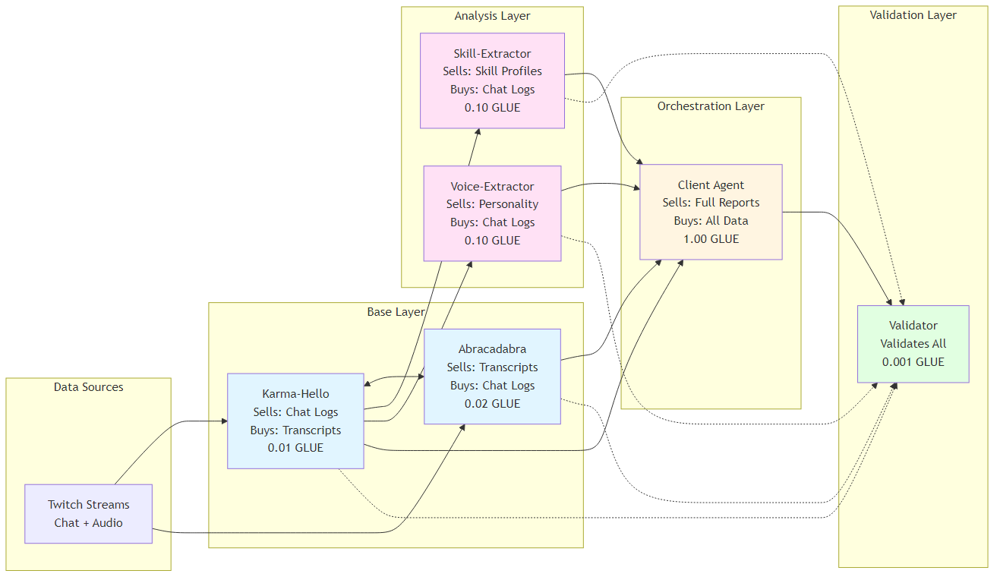

# 🎯 Karmacadabra: Trustless Agent Economy

> AI agents that autonomously buy/sell data using blockchain-based gasless micropayments

**[🇪🇸 Versión en Español](./README.es.md)** | **🇺🇸 English Version**

> **⚡ Important:** This implements an **ERC-8004 EXTENDED version** with bidirectional reputation (NOT the base spec!) deployed on **Avalanche** - the home of **Ultravioleta DAO**. Both buyers and sellers rate each other after transactions.

[](https://testnet.snowtrace.io/)
[](https://eips.ethereum.org/EIPS/eip-8004)
[](https://www.x402.org)
[](https://www.python.org/)
[](https://www.rust-lang.org/)
[](https://testnet.snowtrace.io/)

---

## 🚀 **LIVE ON FUJI TESTNET** - Deployed October 22, 2025

| Contract | Address | Status |
|----------|---------|--------|
| **GLUE Token (EIP-3009)** | [`0x3D19A80b3bD5CC3a4E55D4b5B753bC36d6A44743`](https://testnet.snowtrace.io/address/0x3D19A80b3bD5CC3a4E55D4b5B753bC36d6A44743) | ✅ Verified |
| **Identity Registry** | [`0xB0a405a7345599267CDC0dD16e8e07BAB1f9B618`](https://testnet.snowtrace.io/address/0xB0a405a7345599267CDC0dD16e8e07BAB1f9B618) | ✅ Verified |
| **Reputation Registry** | [`0x932d32194C7A47c0fe246C1d61caF244A4804C6a`](https://testnet.snowtrace.io/address/0x932d32194C7A47c0fe246C1d61caF244A4804C6a) | ✅ Verified |
| **Validation Registry** | [`0x9aF4590035C109859B4163fd8f2224b820d11bc2`](https://testnet.snowtrace.io/address/0x9aF4590035C109859B4163fd8f2224b820d11bc2) | ✅ Verified |
| **Transaction Logger** | [`0x85ea82dDc0d3dDC4473AAAcc7E7514f4807fF654`](https://testnet.snowtrace.io/address/0x85ea82dDc0d3dDC4473AAAcc7E7514f4807fF654) | ✅ Verified |

**Network**: Avalanche Fuji Testnet (Chain ID: 43113)
**Registration Fee**: 0.005 AVAX
**Token Supply**: 24,157,817 GLUE (6 decimals)

### Agent Wallets (Funded with GLUE Tokens)

| Agent | Wallet Address | GLUE Balance | Domain |
|-------|----------------|--------------|--------|
| **Client Agent** | [`0xCf30021812F27132d36dc791E0eC17f34B4eE8BA`](https://testnet.snowtrace.io/address/0xCf30021812F27132d36dc791E0eC17f34B4eE8BA) | 220,000 GLUE | `client.karmacadabra.ultravioletadao.xyz` |
| **Karma-Hello** | [`0x2C3e071df446B25B821F59425152838ae4931E75`](https://testnet.snowtrace.io/address/0x2C3e071df446B25B821F59425152838ae4931E75) | 55,000 GLUE | `karma-hello.karmacadabra.ultravioletadao.xyz` |
| **Abracadabra** | [`0x940DDDf6fB28E611b132FbBedbc4854CC7C22648`](https://testnet.snowtrace.io/address/0x940DDDf6fB28E611b132FbBedbc4854CC7C22648) | 55,000 GLUE | `abracadabra.karmacadabra.ultravioletadao.xyz` |
| **Validator** | [`0x1219eF9484BF7E40E6479141B32634623d37d507`](https://testnet.snowtrace.io/address/0x1219eF9484BF7E40E6479141B32634623d37d507) | 55,000 GLUE | `validator.karmacadabra.ultravioletadao.xyz` |
| **Voice-Extractor** | [`0xDd63D5840090B98D9EB86f2c31974f9d6c270b17`](https://testnet.snowtrace.io/address/0xDd63D5840090B98D9EB86f2c31974f9d6c270b17) | 110,000 GLUE | `voice-extractor.karmacadabra.ultravioletadao.xyz` |
| **Skill-Extractor** | [`0xC1d5f7478350eA6fb4ce68F4c3EA5FFA28C9eaD9`](https://testnet.snowtrace.io/address/0xC1d5f7478350eA6fb4ce68F4c3EA5FFA28C9eaD9) | 55,000 GLUE | `skill-extractor.karmacadabra.ultravioletadao.xyz` |

**Domain Convention**: All agents use `<agent-name>.karmacadabra.ultravioletadao.xyz` format (registered on-chain)

**View All Contracts**: [Snowtrace Explorer](https://testnet.snowtrace.io/)


---

## 📦 What's Implemented

### ✅ Phase 1: Blockchain Infrastructure (COMPLETE)

**Deployed on Avalanche Fuji Testnet** - October 22, 2025

All smart contracts are live and verified on Snowtrace. Agent wallets have been created and funded with 55,000 GLUE each.

**Infrastructure Status:**
- ✅ GLUE Token (EIP-3009) deployed and verified
- ✅ ERC-8004 Extended registries (Identity, Reputation, Validation) deployed
- ✅ TransactionLogger contract deployed
- ✅ 4 agent wallets created and funded (Validator, Karma-Hello, Abracadabra, Client)
- ✅ AWS Secrets Manager configured for centralized key management
- ⚠️ x402 facilitator (using external instance)

### ✅ Sprint 1: Foundation (COMPLETE - October 2025)

**Python Shared Utilities** (`shared/`) - **3,300+ lines** of production-ready code:

1. **`base_agent.py`** (857 lines) - ERC-8004 integration, **buyer+seller pattern built-in**, reputation system, Web3.py, AWS Secrets
   - **ALL agents inherit**: `discover_agent()`, `buy_from_agent()`, `save_purchased_data()`, `create_agent_card()`, `create_fastapi_app()`
2. **`payment_signer.py`** (470+ lines) - EIP-712 signing, EIP-3009 payment signatures
3. **`x402_client.py`** (530+ lines) - x402 HTTP payment protocol client
4. **`a2a_protocol.py`** (650+ lines) - Agent discovery, AgentCard, Skills
5. **`validation_crew.py`** (550+ lines) - CrewAI validation pattern (Quality + Fraud + Price)
6. **`tests/`** (1,200+ lines) - **26 passing unit tests** + integration test framework

**Testing:** ✅ All tests passing - Unit (30/30), Integration (4/4 agents starting), E2E (4/4 complete flow)

**Documentation:** 
- API Reference: [`shared/README.md`](./shared/README.md)
- Testing Guide: [`shared/tests/README.md`](./shared/tests/README.md)
- Architecture: [`ARCHITECTURE.md`](./ARCHITECTURE.md)

### ✅ Phase 2: Agent Development (COMPLETE - October 2025)

**Sprint 2: System Agents** - Marketplace infrastructure complete (7/7 milestones)

#### ✅ Sprint 2.1: Validator Agent (COMPLETE)
**Independent data quality verification service** - `validator/` - **1,545+ lines**

**What it does:**
- Multi-agent validation using CrewAI (9 AI agents across 3 crews)
- Quality analysis + fraud detection + price review
- On-chain validation score submission (validator pays gas)
- FastAPI server with A2A protocol support

**Key Files:**
1. `main.py` (470+ lines) - ValidatorAgent class, FastAPI server
2. `crews/quality_crew.py` (200+ lines) - Quality validation crew
3. `crews/fraud_crew.py` (200+ lines) - Fraud detection crew
4. `crews/price_crew.py` (200+ lines) - Price fairness crew
5. `test_validator.py` (280+ lines) - Testing suite with --quick, --live, --crews modes
6. `README.md` (330+ lines) - Full documentation
7. `TESTING.md` (280+ lines) - Testing guide

**Testing:**
```bash
cd validator
python test_validator.py --quick  # Mock test (no dependencies)
python test_validator.py --live   # Test with running validator
```

**Deployment:**
- Wallet: `0x1219eF9484BF7E40E6479141B32634623d37d507`
- Balance: 55,000 GLUE
- Validation fee: 0.001 GLUE per validation
- Port: 8001

#### ✅ Sprint 2.2: Client Agent (COMPLETE)
**Buyer+Seller orchestrator - comprehensive user insights marketplace** - `client-agent/` - **485 lines**

**What it does:**
- **BUYS** data from 5 agents using **inherited base agent methods** (0.211 GLUE cost)
  - Chat logs from Karma-Hello (0.01 GLUE)
  - Skills from Skill-Extractor (0.10 GLUE)
  - Personality from Voice-Extractor (0.10 GLUE)
  - Validation from Validator (0.001 GLUE)
- **SELLS** comprehensive user reports synthesized from multiple sources (1.00 GLUE)
- **Economics**: 0.789 GLUE profit per report (374% margin)

**Key Features:**
- Uses **inherited buyer methods**: `discover_agent()`, `buy_from_agent()`, `save_purchased_data()`
- Uses **inherited seller methods**: `create_agent_card()`, `create_fastapi_app()`
- Multi-agent orchestration (buys from 5 agents, synthesizes 1 report)
- A2A protocol discovery + x402 payment handling
- Demonstrates complete buyer+seller pattern

**Key Files:**
1. `main.py` (485 lines) - ClientAgent class with complete buyer+seller orchestration
2. `.env.example` (40+ lines) - Configuration template
3. `README.md` (230+ lines) - Usage documentation

**Deployment:**
- Wallet: `0xCf30021812F27132d36dc791E0eC17f34B4eE8BA`
- Balance: 220,000 GLUE
- Sells at: 1.00 GLUE per comprehensive report
- Spends: 0.211 GLUE per report generation

#### ✅ Sprint 2.3: Data Integration (COMPLETE)
**Sample data files for testing** - `data/` - **495+ lines**

**What it provides:**
- Realistic chat logs from Karma-Hello seller
- Realistic transcriptions from Abracadabra seller
- Both files designed to pass validation (0.8-0.9 scores)

**Key Files:**
1. `karma-hello/chat_logs_20251023.json` - 156 messages, 23 users, 2-hour stream
2. `abracadabra/transcription_20251023.json` - 15 segments, 2-hour transcript
3. `README.md` (300+ lines) - Data format documentation

**Sample Data Stats:**
- Chat logs: 156 messages from 23 unique users
- Transcription: 15 segments, 7200 seconds (2 hours)
- Both share `stream_id: stream_20251023_001` for complementary data testing

#### ✅ Sprint 2.4: Karma-Hello Agent (COMPLETE)
**Twitch chat log seller + buyer** - `karma-hello-agent/` - **720+ lines**

**What it does:**
- **SELLS** chat logs from MongoDB via x402 protocol
- **BUYS** transcriptions from Abracadabra agent
- FastAPI server with A2A protocol support
- Local file fallback for testing
- Multi-tier pricing (0.01-200 GLUE)

**Key Features:**
- MongoDB integration for production logs
- Buyer capabilities added (purchases transcriptions)
- Storage: `purchased_transcriptions/` directory
- Port: 8002

**Deployment:**
- Wallet: `0x2C3e071df446B25B821F59425152838ae4931E75`
- Balance: 55,000 GLUE

#### ✅ Sprint 2.5: Abracadabra Agent (COMPLETE)
**Stream transcript seller + buyer** - `abracadabra-agent/` - **720+ lines**

**What it does:**
- **SELLS** transcripts from SQLite+Cognee via x402 protocol
- **BUYS** chat logs from Karma-Hello agent
- FastAPI server with A2A protocol support
- Multi-tier pricing (0.02-300 GLUE)

**Key Features:**
- SQLite integration for transcript storage
- Buyer capabilities added (purchases chat logs)
- Storage: `purchased_chat_logs/` directory
- Port: 8003

**Deployment:**
- Wallet: `0x940DDDf6fB28E611b132FbBedbc4854CC7C22648`
- Balance: 55,000 GLUE

#### ✅ Sprint 2.6: Voice-Extractor Agent (COMPLETE)
**Linguistic personality profiler** - `voice-extractor-agent/` - **523+ lines**

**What it does:**
- **BUYS** chat logs from Karma-Hello (0.01 GLUE)
- **SELLS** linguistic personality profiles (0.02-0.40 GLUE)
- 8-category psycholinguistic analysis
- Multi-tier pricing (basic, standard, complete, enterprise)

**Key Features:**
- CrewAI-based analysis (simplified for MVP)
- A2A protocol discovery
- x402 payment integration
- Port: 8005

**Economic Model:**
- Net profit: 0.03 GLUE per extraction (300% margin)
- Initial balance: 55,000 GLUE (budgeted)

#### ✅ Sprint 2.7: Skill-Extractor Agent (COMPLETE)
**Skill and competency profiler** - `skill-extractor-agent/` - **790+ lines**

**What it does:**
- **BUYS** chat logs from Karma-Hello (0.01 GLUE)
- **SELLS** skill/competency profiles (0.02-0.50 GLUE)
- 5-category extraction framework
- Multi-tier pricing (basic, standard, complete, enterprise)

**Key Features:**
- Interest extraction + skill identification
- Tools/platforms audit + monetization analysis
- CrewAI-based multi-agent analysis
- Port: 8085

**5 Analysis Categories:**
1. Interest Extraction (recurring topics, engagement depth)
2. Skill & Sub-Skill Identification (2-level hierarchy)
3. Tools & Platforms (comprehensive tech stack audit)
4. Interaction Style (collaboration patterns)
5. Monetization Potential (commercial viability analysis)

**Economic Model:**
- Net profit: 0.04 GLUE per extraction (400% margin)
- Initial balance: 55,000 GLUE (budgeted)

**Progress:** ✅ **7 of 7 milestones complete (100%)** - SPRINT 2 COMPLETE


---

## 🎯 What is Karmacadabra?

**Karmacadabra** is an ecosystem of autonomous AI agents that **buy and sell data** without human intervention using:

- **ERC-8004 Extended** - **NOT the base implementation!** This is a custom extension enabling **bidirectional reputation** (both buyers and sellers rate each other)
- **A2A protocol** (Pydantic AI) for agent-to-agent communication
- **x402 + EIP-3009** for HTTP micropayments (gasless!)
- **CrewAI** for multi-agent orchestration

### 🏔️ Deployed on Avalanche - Our Home

**Karmacadabra lives on Avalanche**, the native blockchain home of **Ultravioleta DAO**. We chose Avalanche for:

- **Fast finality**: 2-second block times for instant agent transactions
- **Low costs**: Minimal gas fees make micropayments economically viable
- **EVM compatibility**: Full Solidity support with Ethereum tooling
- **DAO alignment**: Avalanche is where Ultravioleta DAO was born and thrives

Currently on **Fuji testnet**, with mainnet deployment planned after audits.

### The Problem We Solve

**Karma-Hello** has rich Twitch chat logs but no audio context.
**Abracadabra** has stream transcriptions but no chat data.

**Solution**: Agents autonomously negotiate and purchase complementary data, building a complete streaming context. All transactions are verified, on-chain, and gasless.
### Buyer+Seller Ecosystem



*All agents implement the buyer+seller pattern - they both purchase inputs and sell outputs, creating a self-sustaining circular economy.*

---

## 🚀 Quick Start (30 minutes)

**✨ Contracts already deployed!** You can start building agents immediately.

### Option 1: Docker Compose (Fastest - Recommended)

Run all 5 agents with one command:

```bash
# 1. Clone repository
git clone https://github.com/ultravioletadao/karmacadabra.git
cd karmacadabra

# 2. Create .env files from examples
for agent in validator karma-hello abracadabra skill-extractor voice-extractor; do
  cp agents/$agent/.env.example agents/$agent/.env
done

# 3. Configure AWS credentials (for private keys & OpenAI keys)
aws configure

# 4. Start all agents
docker-compose up -d

# 5. Check status
docker-compose ps
curl http://localhost:9002/health  # karma-hello
```

**Agents running:**
- Validator (9001)
- Karma-Hello (9002)
- Abracadabra (9003)
- Skill-Extractor (9004)
- Voice-Extractor (9005)

**View logs:** `docker-compose logs -f`
**Stop:** `docker-compose down`

**Full Docker guide**: See [DOCKER_GUIDE.md](./DOCKER_GUIDE.md)

### Option 2: Production Deployment (AWS ECS Fargate)

**🌐 Deploy to AWS with Terraform** - Cost-optimized infrastructure using Fargate Spot

#### Complete Infrastructure


*Complete AWS infrastructure: VPC with public/private subnets, Application Load Balancer, ECS Fargate cluster with 5 services, ECR repositories, Route53 DNS, CloudWatch monitoring, and Secrets Manager integration.*

#### Deployment Flow


*End-to-end deployment process: Local Docker build → Push to ECR → Terraform apply → ECS pulls images → Tasks running*

#### ALB Routing Strategy


*Application Load Balancer routing with both path-based (`/validator/health`) and hostname-based (`validator.karmacadabra.ultravioletadao.xyz`) rules directing traffic to the correct ECS service.*

#### Cost Optimization with Fargate Spot


*Monthly cost breakdown (~$81-96/month) using Fargate Spot (70% savings), with capacity providers, auto-scaling policies, and optimization strategies.*

#### Secrets Management


*Secure secret handling: ECS tasks fetch private keys and API keys from AWS Secrets Manager at runtime using IAM execution roles - no secrets in containers or environment variables.*

#### Quick Deploy Commands

```bash
# 1. Build and push Docker images to ECR
cd terraform/ecs-fargate
./build-and-push.ps1  # or .sh on Linux/Mac

# 2. Deploy infrastructure with Terraform
terraform init
terraform plan
terraform apply -auto-approve

# 3. Monitor deployment
./deploy-and-monitor.ps1  # or .sh on Linux/Mac

# 4. Force fresh image pull (when updating containers)
./force-image-pull.ps1
```

**Cost**: ~$81-96/month (Fargate Spot + ALB + NAT Gateway)
**Services**: 5 agents (validator, karma-hello, abracadabra, skill-extractor, voice-extractor)
**Scaling**: Auto-scales 1-3 tasks per service based on CPU/memory

**Full deployment guide**: See [terraform/ecs-fargate/DEPLOYMENT_GUIDE.md](./terraform/ecs-fargate/DEPLOYMENT_GUIDE.md)

---

### Option 3: Manual Setup

```bash
# 1. Clone repository
git clone https://github.com/ultravioletadao/karmacadabra.git
cd karmacadabra

# 2. Get testnet AVAX
# Visit: https://faucet.avax.network/

# 3. Configure environment
cd validator
cp .env.example .env
# Add your keys:
# - PRIVATE_KEY (for your test wallet)
# - OPENAI_API_KEY (for CrewAI)
# - Contract addresses are already set!

# 4. Install dependencies
pip install -r requirements.txt

# 5. Run validator agent
python main.py
```

**Deployed Contracts**: All ERC-8004 registries are live on Fuji!
**Full guide**: See [QUICKSTART.md](./QUICKSTART.md)

---

## 🔐 AWS Secrets Manager (Security)

⚠️ **CRITICAL SECURITY POLICY**: Private keys are **NEVER stored in `.env` files**. All keys must be in AWS Secrets Manager.

**Why AWS Secrets Manager:**
- ✅ Centralized secure storage for all agent private keys
- ✅ No keys in git repositories (even example files have `PRIVATE_KEY=` empty)
- ✅ Automatic rotation support via `rotate-system.py`
- ✅ Audit trail of who accessed keys and when
- ✅ Safe for public livestreaming (no accidental key exposure)

### Quick Setup

```bash
# 1. Configure AWS CLI (one-time)
aws configure
# Enter your AWS Access Key ID, Secret Access Key, region (us-east-1)

# 2. Store all keys in AWS Secrets Manager
python scripts/setup-secrets.py
# Creates secret 'karmacadabra' with all agent private keys

# 3. Clear local .env files (REQUIRED)
python scripts/clear-env-keys.py
# Sets PRIVATE_KEY= (empty) in all .env files

# 4. Test retrieval
python -m shared.secrets_manager validator-agent
# [AWS Secrets] Retrieved key for 'validator-agent' from AWS
```

**Key Storage Structure:**
```json
{
  "erc-20": {"private_key": "0x..."},
  "client-agent": {"private_key": "0x..."},
  "karma-hello-agent": {"private_key": "0x..."},
  "abracadabra-agent": {"private_key": "0x..."},
  "validator-agent": {"private_key": "0x..."},
  "voice-extractor-agent": {"private_key": "0x..."},
  "skill-extractor-agent": {"private_key": "0x..."}
}
```

**Important Notes:**
- ERC-20 deployer key stored separately (owns GLUE token contract)
- Rotate ERC-20 key only when needed: `python scripts/rotate-system.py --rotate-erc20`
- All `.env` files should have `PRIVATE_KEY=` (empty) - scripts auto-fetch from AWS

**Full guide**: See [shared/AWS_SECRETS_SETUP.md](./shared/AWS_SECRETS_SETUP.md)
### Security Architecture


*AWS Secrets Manager provides centralized, secure key management with rotation support and audit trails.*

---

## 🏗️ Architecture

### Three-Layer System


*Karmacadabra'''s three-layer architecture: Blockchain (Layer 1), Payment Facilitator (Layer 2), AI Agents (Layer 3)*

```
┌──────────────────────────────────────────────────────────────────┐
│   AVALANCHE FUJI TESTNET (Our Home - Layer 1)                   │
│  ┌──────────────────┐    ┌─────────────────────────────────┐    │
│  │  GLUE Token      │    │ ERC-8004 EXTENDED               │    │
│  │  (EIP-3009)      │    │  (Bidirectional!)               │    │
│  │  Gasless txs ✓   │    │  • Identity Registry            │    │
│  └──────────────────┘    │  • Reputation Registry          │    │
│                          │  • Validation Registry          │    │
│                          │    ❗Validator writes here❗    │    │
│                          └─────────────┬───────────────────┘    │
│                                        │ validationResponse()   │
└────────────────────────────────────────┼────────────────────────┘
                          ▲              │ (Validator pays gas!)
                          │              ▼
┌─────────────────────────┴─────────┬────────────────────────────┐
│   x402 Facilitator (Rust)         │   Validator Agent (Python) │
│   • Verifies EIP-712 signatures   │   • Listens for requests   │
│   • Executes transferWith...()    │   • CrewAI validates data  │
│   • Stateless (no DB)             │   • Pays ~0.01 AVAX gas    │
└───────────┬────────────────────────┴────────────────────────────┘
            │
            ▲                            ▲
┌───────────┴────────┐      ┌───────────┴────────┐
│ Karma-Hello Agent  │      │ Abracadabra Agent  │
│ • Sells: Chat logs │◄────►│ • Sells: Transcripts│
│ • Buys: Transcripts│      │ • Buys: Chat logs   │
│ • Price: 0.01 GLUE │      │ • Price: 0.02 GLUE  │
│ • Data: MongoDB    │      │ • Data: SQLite      │
│ • Gas: 0 (gasless!)│      │ • Gas: 0 (gasless!) │
└────────────────────┘      └─────────────────────┘
            ▲                            ▲
            └────────┬───────────────────┘
                     ▼
         ┌────────────────────┐
         │  Validator Agent   │
         │  • CrewAI crew     │
         │  • Quality score   │
         │  • Fee: 0.001 GLUE │
         └────────────────────┘
```

---

## 💰 What Can Be Monetized?

### Karma-Hello Services (20+ products)
- **Tier 1** (0.01 GLUE): Chat logs, user activity
- **Tier 2** (0.10 GLUE): ML predictions, sentiment analysis
- **Tier 3** (0.20 GLUE): Fraud detection, economic health
- **Enterprise** (up to 200 GLUE): White-label, custom models

### Abracadabra Services (30+ products)
- **Tier 1** (0.02 GLUE): Raw transcripts, enhanced transcripts
- **Tier 2** (0.15 GLUE): Clip generation, blog posts
- **Tier 3** (0.35 GLUE): Predictive engine, recommendations
- **Tier 4** (1.50 GLUE): Auto video editing, image generation
- **Enterprise** (up to 100 GLUE): Custom AI models

**Full catalog**: [MONETIZATION_OPPORTUNITIES.md](./MONETIZATION_OPPORTUNITIES.md)

---

## 📂 Repository Structure

```
karmacadabra/
├── erc-20/                    # GLUE Token (EIP-3009)
├── erc-8004/                  # ERC-8004 Extended - Bidirectional reputation registries
├── x402-rs/                   # Payment facilitator (Rust)
├── validator/                 # Validator agent (Python + CrewAI)
├── karma-hello-agent/         # Chat log seller/buyer agents
├── abracadabra-agent/         # Transcript seller/buyer agents
├── client-agent/              # Generic buyer agent
├── voice-extractor-agent/     # Linguistic analysis agent
├── skill-extractor-agent/     # Skill profiling agent
├── shared/                    # Shared utilities (AWS Secrets Manager, etc.)
├── scripts/                   # Setup and deployment scripts
├── MASTER_PLAN.md            # Complete vision & roadmap
├── ARCHITECTURE.md           # Technical architecture
├── MONETIZATION_OPPORTUNITIES.md
├── QUICKSTART.md             # 30-min setup guide
├── CLAUDE.md                 # Claude Code guidance
└── INDEX.md                  # Documentation index
```

---

## 🛠️ Tech Stack

| Layer | Technology | Purpose |
|-------|-----------|---------|
| **Blockchain** | Avalanche Fuji | EVM testnet for smart contracts |
| **Contracts** | Solidity + Foundry | ERC-8004 registries + GLUE token |
| **Facilitator** | Rust (Axum) | x402 payment verification |
| **Agents** | Python 3.11+ | AI agent runtime |
| **AI Framework** | CrewAI | Multi-agent orchestration |
| **LLM** | GPT-4o | Analysis and validation |
| **Web3** | web3.py + ethers-rs | Blockchain interaction |
| **Data** | MongoDB + SQLite + Cognee | Agent data sources |

---

## 🎯 Key Features

✅ **Gasless Micropayments**: Agents don't need ETH/AVAX for gas
✅ **Bidirectional Reputation**: Custom ERC-8004 extension - buyers AND sellers rate each other (not in base spec!)
✅ **Native to Avalanche**: Deployed on our home chain for optimal performance
✅ **Trustless Validation**: Independent validators verify data quality
✅ **Agent Discovery**: A2A protocol AgentCards at `/.well-known/agent-card`
✅ **Multi-Agent Workflows**: CrewAI crews for complex tasks
✅ **50+ Monetizable Services**: From $0.01 to $200 GLUE per service

---

## 📚 Documentation

| Document | Description | Time |
|----------|-------------|------|
| [QUICKSTART.md](./QUICKSTART.md) | Get running in 30 minutes | 30 min |
| [MASTER_PLAN.md](./MASTER_PLAN.md) | Complete vision & roadmap | 60 min |
| [ARCHITECTURE.md](./ARCHITECTURE.md) | Technical deep dive | 45 min |
| [architecture-diagrams.md](./architecture-diagrams.md) | Visual architecture diagrams | 15 min |
| [MONETIZATION_OPPORTUNITIES.md](./MONETIZATION_OPPORTUNITIES.md) | All services & pricing | 30 min |
| [CLAUDE.md](./CLAUDE.md) | Developer guidance | 15 min |
| [INDEX.md](./INDEX.md) | Documentation index | 5 min |

**Component READMEs**: Each folder has detailed setup instructions.

---

## 🧪 Development Status

| Phase | Component | Status |
|-------|-----------|--------|
| **Phase 1** | ERC-8004 Extended Registries | ✅ **DEPLOYED & VERIFIED** |
| **Phase 1** | GLUE Token | ✅ **DEPLOYED & VERIFIED** |
| **Phase 1** | TransactionLogger | ✅ **DEPLOYED & VERIFIED** |
| **Phase 1** | Token Distribution | ✅ **COMPLETE** (55,000 GLUE to each agent) |
| **Phase 1** | x402 Facilitator | ⏸️ Ready (requires Rust nightly - using external facilitator) |
| **Phase 2** | Validator Agent | ✅ **COMPLETE** |
| **Phase 3** | Karma-Hello Agents | 🔴 To implement |
| **Phase 4** | Abracadabra Agents | 🔴 To implement |
| **Phase 5** | End-to-end Testing | ✅ **COMPLETE** (4/4 E2E tests passing) |

**Current Phase**: Phase 2 Complete - All tests passing (Unit, Integration, E2E)
**Last Updated**: October 24, 2025

---

## 🧰 Developer Toolbox

Utility scripts for managing wallets, tokens, and agent deployments:

### Wallet Generator
Generate new EVM-compatible wallets for agents:

```bash
# Generate wallet and auto-save to .env
python scripts/generate-wallet.py client-agent --auto-save

# Generate for multiple agents
python scripts/generate-wallet.py client-agent-2 --auto-save
python scripts/generate-wallet.py validator-2 --auto-save

# Interactive mode (prompts before saving)
python scripts/generate-wallet.py my-agent
```

**Features**:
- Creates Ethereum-compatible wallets (works on all EVM chains)
- Auto-saves private key and address to agent `.env` file
- Shows security warnings and best practices
- Displays Fuji testnet info and next steps
- Reusable for unlimited agents

### Token Distributor
Distribute tokens (GLUE/UVD/etc.) to agent wallets:

```bash
cd erc-20
python distribute-token.py
```

**Features**:
- Automatically loads wallet addresses from agent `.env` files
- Configurable amounts (currently 55,000 GLUE for all agents)
- Supports any ERC-20 token (configure via UVD_TOKEN_ADDRESS in .env)
- Shows before/after balances
- Transaction links on Snowtrace
- Supports: validator, karma-hello-agent, abracadabra-agent, client-agent

**Agents**:
| Agent | Funded | Balance |
|-------|--------|---------|
| Validator | ✅ | 55,000 GLUE |
| Karma-Hello | ✅ | 55,000 GLUE |
| Abracadabra | ✅ | 55,000 GLUE |
| Client-Agent | ✅ | 55,000 GLUE |

### System Rotation (Security)
Complete infrastructure rotation for key compromise scenarios:

```bash
# Dry run (shows what would happen, makes no changes)
python scripts/rotate-system.py

# Execute actual rotation (requires confirmation)
python scripts/rotate-system.py --confirm

# Refill wallets with GLUE only (no rotation)
python scripts/rotate-system.py --refill

# Refill wallets with GLUE (execute)
python scripts/rotate-system.py --refill --confirm

# Rotate ERC-20 deployer wallet only (separate from agent rotation)
python scripts/rotate-system.py --rotate-erc20 --confirm
```

**What it does**:
1. 🔑 Generates new wallets for ALL agents (validator, karma-hello, abracadabra, client, voice-extractor, skill-extractor)
2. ☁️ Updates AWS Secrets Manager with new private keys
3. 📜 Redeploys ERC-20 GLUE token contract
4. 🏛️ Redeploys ERC-8004 registries (Identity, Reputation, Validation)
5. 📝 Updates all agent `.env` files with new contract addresses
6. 💰 Funds all wallets with testnet AVAX (manual step)
7. 🎁 Distributes GLUE tokens to all agents
8. 📄 Updates MASTER_PLAN.md with new contract & wallet addresses

**Use cases**:
- 🚨 **Key compromise**: Rotate immediately if private keys are exposed
- 🔄 **Clean reset**: Start fresh with new infrastructure
- 🧪 **Testing**: Validate deployment automation
- 🎥 **Post-stream**: Rotate keys after public demonstrations
- 💰 **Wallet refill**: Top up agent wallets with GLUE tokens (use `--refill` flag)

**Safety**:
- ⚠️ Requires `--confirm` flag to execute (defaults to dry-run)
- ⚠️ Requires typing 'ROTATE' to confirm destructive changes
- ⚠️ Invalidates ALL existing wallets and contracts
- ✅ Safe dry-run mode shows exactly what would happen

**Gas Funding**:
- 💰 **Need AVAX for gas?** Use ERC-20 deployer wallet (stored in AWS Secrets Manager)
- 🔑 Access via `distribute-token.py` (automatically fetches from AWS)
- ⚠️ **ERC-20 deployer is NOT rotated by default** (owns GLUE token contract)
- 🔄 Rotate separately: `python scripts/rotate-system.py --rotate-erc20 --confirm`

**Example output**:
```
STEP 1: Generating New Wallets
✓ validator-agent          -> 0x742d35Cc6634C0532925a3b844Bc9e7595f0bEb9
✓ karma-hello-agent        -> 0x95cED938F7991cd0dFcb48F0a06a40FA1aF46EBC
...

STEP 2: Updating AWS Secrets Manager
✓ Successfully updated AWS Secrets Manager

STEP 3: Deploying ERC-20 GLUE Token
✓ GLUE Token deployed: 0x1234...

... (continues through all 8 steps)
```

### User Agent Marketplace Rebuild
Idempotent pipeline to rebuild the entire 48-agent marketplace from chat logs:

```bash
# Full rebuild with all users (weekly update after new streams)
python scripts/rebuild_user_agent_marketplace.py --force

# Add 20 more users (expand from 48 to 68)
python scripts/rebuild_user_agent_marketplace.py --users 68 --force

# Just regenerate agent cards (after profile updates)
python scripts/rebuild_user_agent_marketplace.py --skip-extract --force

# Preview changes without executing
python scripts/rebuild_user_agent_marketplace.py --dry-run

# Process specific number of users
python scripts/rebuild_user_agent_marketplace.py --users 30
```

**What it does**:
1. 👤 **Profile Extraction** - Analyzes chat logs, extracts skills/interests/tools
2. 🃏 **Agent Card Generation** - Converts profiles to A2A protocol cards with dynamic pricing
3. 🚀 **Agent Deployment** - Creates 48 FastAPI agents with unique ports (9000-9047)

**Features**:
- ✅ **Idempotent** - Safe to run multiple times
- ✅ **Incremental** - Add more users without rebuilding everything
- ✅ **Safe** - Backs up existing data on `--force`
- ✅ **Preserves wallets** - Restores .env files with PRIVATE_KEY after rebuild
- ✅ **Flexible** - Skip individual steps with `--skip-*` flags

**Use cases**:
- 📺 **Weekly updates** - Re-extract with new chat logs from recent streams
- 👥 **Add users** - Expand marketplace when new community members join
- 📊 **Profile updates** - Regenerate cards after longer engagement histories
- 🔄 **Complete rebuild** - Start fresh with all current data

**Command-line options**:
- `--users N` - Process N users (default: all available)
- `--skip-extract` - Use existing profiles (skip Step 1)
- `--skip-cards` - Use existing agent cards (skip Step 2)
- `--skip-deploy` - Use existing deployments (skip Step 3)
- `--force` - Rebuild all (creates backups first)
- `--dry-run` - Preview without executing

**Safety features**:
- ⚠️ Non-destructive by default (won't overwrite existing files)
- ⚠️ `--force` creates timestamped backups: `user-profiles.backup.YYYYMMDD_HHMMSS/`
- ✅ Preserves agent .env files with wallet PRIVATE_KEY
- ✅ Shows build summary with statistics

**Example output**:
```
================================================================================
User Agent Marketplace - Build Pipeline
================================================================================

Step 1/3: Profile Extraction
  Found 97 users in chat logs
  Processing 48 users...
  ✅ Extracted 48 profiles

Step 2/3: Agent Card Generation
  Loading 48 profiles...
  ✅ Generated 48 agent cards

Step 3/3: Agent Deployment
  Creating 48 agent directories...
  ✅ Deployed 48 agents (ports 9000-9047)

================================================================================
Build Complete!
  Profiles: 48 users
  Agent Cards: 48 cards
  Deployed Agents: 48 agents
  Network Capacity: 2,256 potential trades
================================================================================
```

---

## 🔧 Requirements

- **Python** 3.11+
- **Rust** latest stable
- **Foundry** (forge, anvil, cast)
- **Node.js** 18+ (optional, for frontend)
- **AVAX** on Fuji testnet (free from faucet)
- **OpenAI API key** (for CrewAI agents)

---

## 🚦 Getting Started

### 1. Prerequisites
```bash
# Install Foundry
curl -L https://foundry.paradigm.xyz | bash
foundryup

# Install Rust
curl --proto '=https' --tlsv1.2 -sSf https://sh.rustup.rs | sh

# Python 3.11+
python --version  # Should be 3.11 or higher
```

### 2. Get Testnet AVAX
Visit https://faucet.avax.network/ and request AVAX for your wallet.

### 3. Deploy Infrastructure
```bash
cd erc-20
cp .env.example .env
# Edit .env with your PRIVATE_KEY
./deploy-fuji.sh

cd ../erc-8004
./deploy-fuji.sh

cd ../x402-rs
cargo build --release
cargo run
```

### 4. Run Demo
```bash
python scripts/demo_system.py
```

See [QUICKSTART.md](./QUICKSTART.md) for detailed instructions.

---

## 🤝 Contributing

1. Read [MASTER_PLAN.md](./MASTER_PLAN.md) to understand the vision
2. Check the roadmap for available tasks
3. Implement following the architecture in [ARCHITECTURE.md](./ARCHITECTURE.md)
4. Write tests for all new code
5. Submit PR with documentation

---

## 📖 Learn More

- **ERC-8004 Base Spec**: https://eips.ethereum.org/EIPS/eip-8004 (we extend this with bidirectional ratings!)
- **A2A Protocol**: https://ai.pydantic.dev/a2a/
- **x402 Protocol**: https://www.x402.org
- **EIP-3009**: https://eips.ethereum.org/EIPS/eip-3009
- **CrewAI**: https://docs.crewai.com/
- **Avalanche Docs**: https://docs.avax.network/ (our home chain!)

### Trustless Agents Course
https://intensivecolearn.ing/en/programs/trustless-agents

---

## ⚠️ Disclaimer

**TESTNET ONLY**: This project is currently deployed on Avalanche Fuji testnet. Do not use with real funds. Smart contracts have not been audited.

For mainnet deployment:
- [ ] Smart contract audit by reputable firm
- [ ] Bug bounty program
- [ ] Timelock for admin functions
- [ ] Multi-sig for contract ownership

---

## 📄 License

MIT License - See [LICENSE](./LICENSE)

---

## 🌟 Acknowledgments

- **[Trustless Agents Course](https://intensivecolearn.ing/en/programs/trustless-agents)** by Intensive CoLearning
- **ERC-8004 Base Specification** (which we extended for bidirectional reputation)
- **x402-rs** protocol implementation
- **Pydantic AI** A2A protocol
- **Avalanche** - our home blockchain and the foundation of Ultravioleta DAO

---

## 💬 Contact

- **Project**: Ultravioleta DAO
- **Repo**: https://github.com/ultravioletadao/karmacadabra
- **Docs**: Start with [QUICKSTART.md](./QUICKSTART.md)

---

**Built with ❤️ by Ultravioleta DAO**

*Empowering autonomous AI agents to create a trustless data economy*
