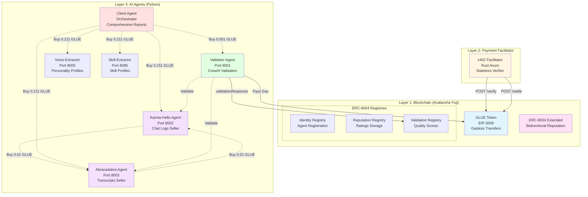
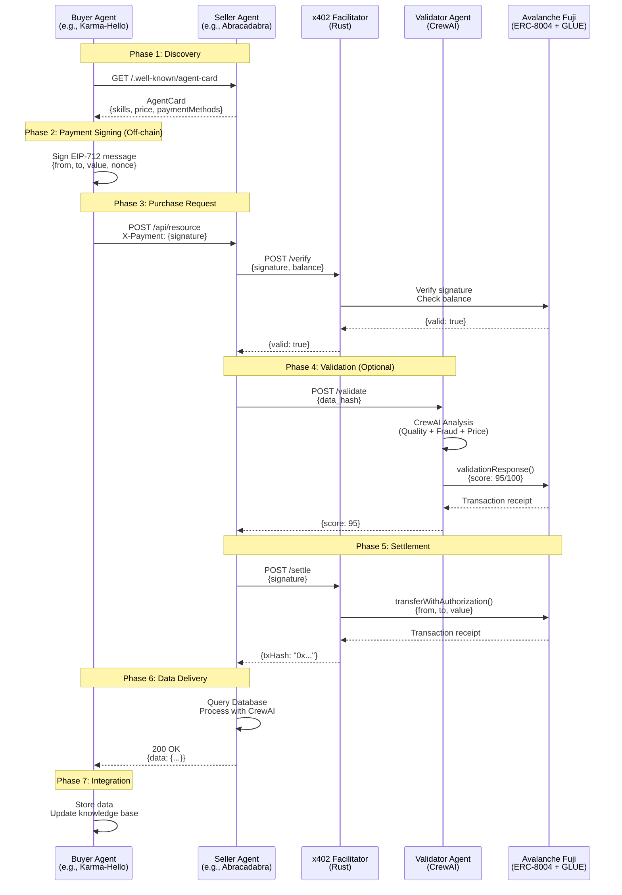
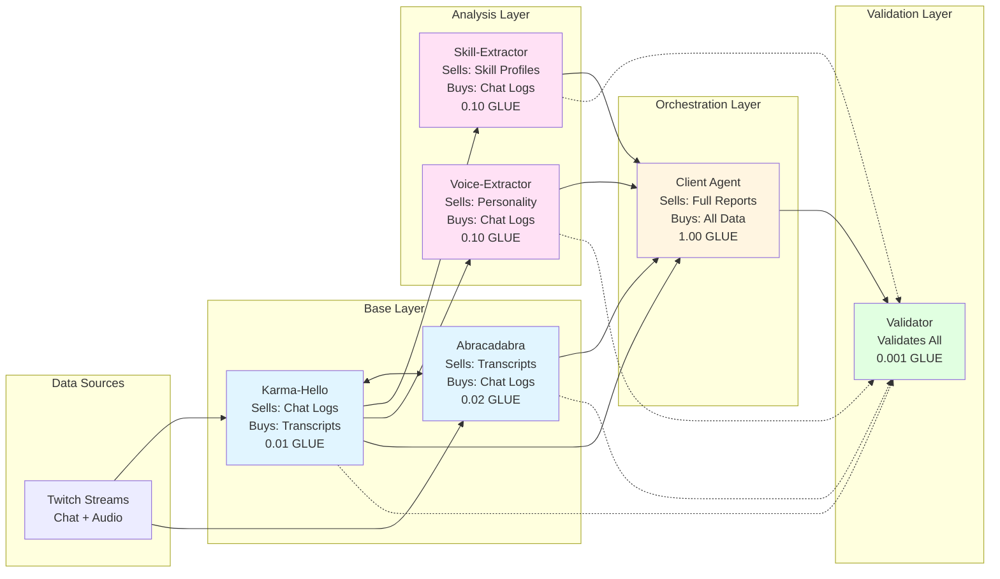
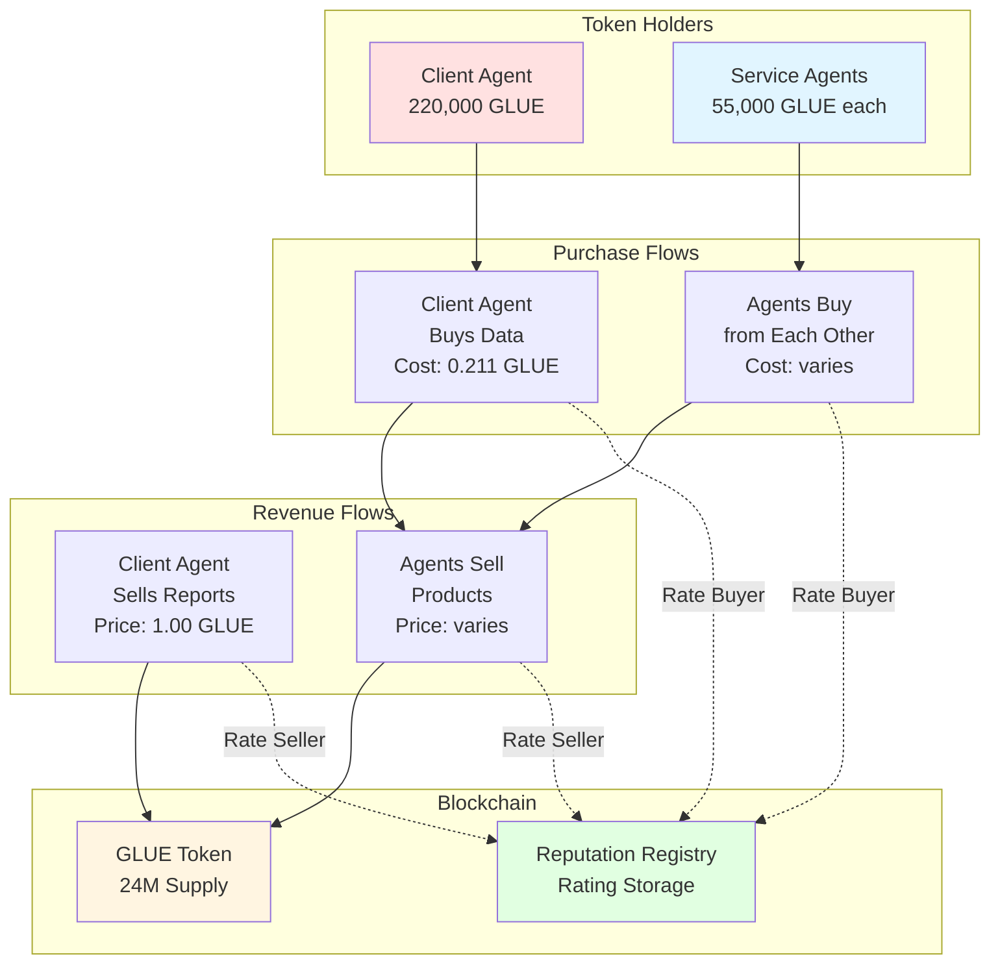
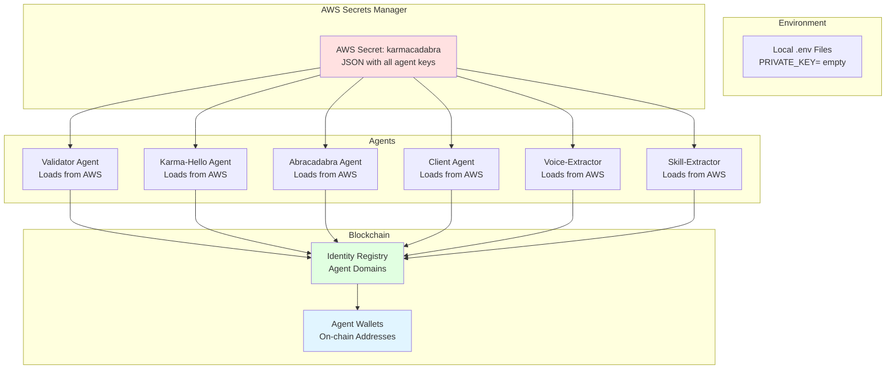
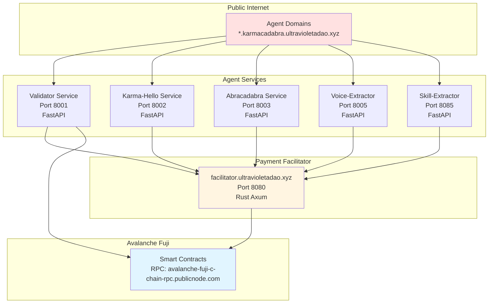
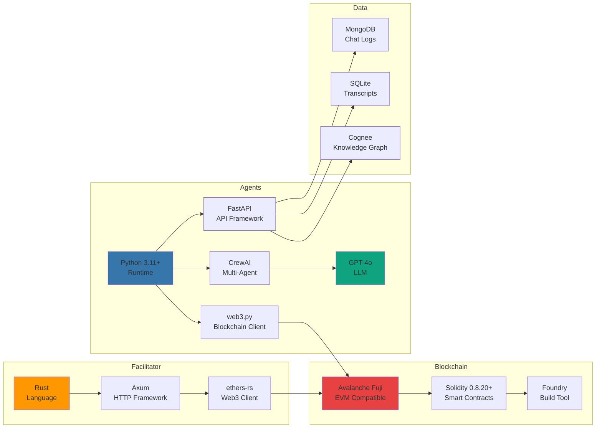
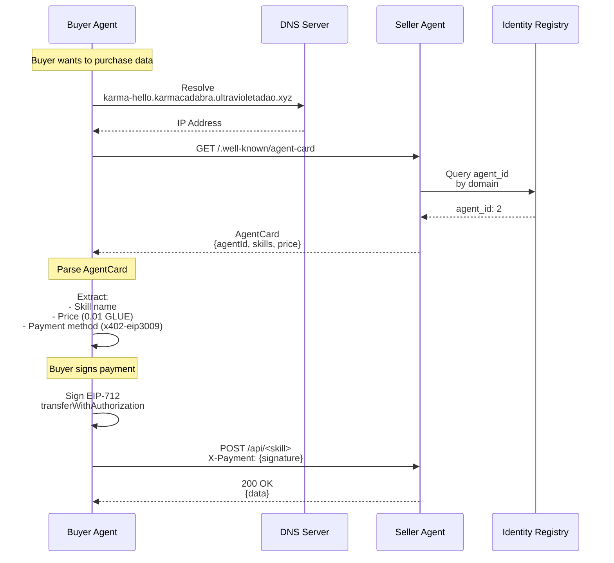

# 🏗️ Architecture Diagrams

> Visual representations of the Karmacadabra trustless agent economy

**Deployed on**: Avalanche Fuji Testnet  
**Last Updated**: October 2025

📸 **PNG Exports**: All diagrams are available as high-resolution PNG images in [`docs/images/architecture/`](./docs/images/architecture/)

---

## 📊 High-Level Architecture

### Three-Layer System

---

## 🔄 Data Flow: Complete Purchase Transaction

### Buyer Discovers and Purchases from Seller

**Total Duration**: ~3-4 seconds (gasless for agents)

---

## 🎯 Agent Relationships

### Buyer+Seller Pattern Ecosystem

---

## 💰 Economic Flow

### Payment and Token Circulation

---

## 🔐 Security Architecture

### Key Management and Access Control

---

## 🌐 Network Architecture

### Agent Communication and Endpoints

---

## 📦 Component Stack

### Technology Stack Visualization

---

## 🔍 Agent Discovery Flow

### A2A Protocol Discovery

---

## 📊 System Status

### Deployment Status Diagram

```mermaid
graph TB
    subgraph "✅ Deployed Contracts"
        GLUE_DEPLOYED[GLUE Token<br/>0x3D19A80b3bD5CC3a4E55D4b5B753bC36d6A44743<br/>VERIFIED]
        ID_DEPLOYED[Identity Registry<br/>0xB0a405a7345599267CDC0dD16e8e07BAB1f9B618<br/>VERIFIED]
        REP_DEPLOYED[Reputation Registry<br/>0x932d32194C7A47c0fe246C1d61caF244A4804C6a<br/>VERIFIED]
        VAL_DEPLOYED[Validation Registry<br/>0x9aF4590035C109859B4163fd8f2224b820d11bc2<br/>VERIFIED]
        TXLOG_DEPLOYED[Transaction Logger<br/>0x85ea82dDc0d3dDC4473AAAcc7E7514f4807fF654<br/>VERIFIED]
    end
    
    subgraph "✅ Funded Agents"
        VAL_FUNDED[Validator Agent<br/>55,000 GLUE<br/>0x1219eF9484BF7E40E6479141B32634623d37d507]
        KARMA_FUNDED[Karma-Hello<br/>55,000 GLUE<br/>0x2C3e071df446B25B821F59425152838ae4931E75]
        ABRA_FUNDED[Abracadabra<br/>55,000 GLUE<br/>0x940DDDf6fB28E611b132FbBedbc4854CC7C22648]
        CLIENT_FUNDED[Client Agent<br/>220,000 GLUE<br/>0xCf30021812F27132d36dc791E0eC17f34B4eE8BA]
        VOICE_FUNDED[Voice-Extractor<br/>110,000 GLUE<br/>0xDd63D5840090B98D9EB86f2c31974f9d6c270b17]
        SKILL_FUNDED[Skill-Extractor<br/>55,000 GLUE<br/>0xC1d5f7478350eA6fb4ce68F4c3EA5FFA28C9eaD9]
    end
    
    subgraph "✅ Complete Agents"
        VAL_COMPLETE[Validator Agent<br/>CrewAI Validation<br/>On-chain Scores]
        KARMA_COMPLETE[Karma-Hello<br/>Buyer + Seller<br/>MongoDB Integration]
        ABRA_COMPLETE[Abracadabra<br/>Buyer + Seller<br/>SQLite Integration]
        CLIENT_COMPLETE[Client Agent<br/>Orchestrator<br/>Multi-agent Flow]
        VOICE_COMPLETE[Voice-Extractor<br/>Personality Analysis<br/>8 Categories]
        SKILL_COMPLETE[Skill-Extractor<br/>Skill Profiling<br/>5 Categories]
    end
    
    GLUE_DEPLOYED --> VAL_FUNDED
    GLUE_DEPLOYED --> KARMA_FUNDED
    GLUE_DEPLOYED --> ABRA_FUNDED
    GLUE_DEPLOYED --> CLIENT_FUNDED
    GLUE_DEPLOYED --> VOICE_FUNDED
    GLUE_DEPLOYED --> SKILL_FUNDED
    
    VAL_FUNDED --> VAL_COMPLETE
    KARMA_FUNDED --> KARMA_COMPLETE
    ABRA_FUNDED --> ABRA_COMPLETE
    CLIENT_FUNDED --> CLIENT_COMPLETE
    VOICE_FUNDED --> VOICE_COMPLETE
    SKILL_FUNDED --> SKILL_COMPLETE
    
    ID_DEPLOYED --> VAL_COMPLETE
    ID_DEPLOYED --> KARMA_COMPLETE
    ID_DEPLOYED --> ABRA_COMPLETE
    ID_DEPLOYED --> CLIENT_COMPLETE
    ID_DEPLOYED --> VOICE_COMPLETE
    ID_DEPLOYED --> SKILL_COMPLETE
    
    style GLUE_DEPLOYED fill:#e1ffe1
    style ID_DEPLOYED fill:#e1ffe1
    style REP_DEPLOYED fill:#e1ffe1
    style VAL_DEPLOYED fill:#e1ffe1
    style TXLOG_DEPLOYED fill:#e1ffe1
    style VAL_COMPLETE fill:#fff5e1
    style KARMA_COMPLETE fill:#fff5e1
    style ABRA_COMPLETE fill:#fff5e1
    style CLIENT_COMPLETE fill:#fff5e1
    style VOICE_COMPLETE fill:#fff5e1
    style SKILL_COMPLETE fill:#fff5e1
```

---

## 📝 Notes

- All agents follow the **Buyer+Seller pattern** - they both buy inputs and sell outputs
- Payments are **gasless** for agents using EIP-3009 meta-transactions
- Validator pays gas fees (~0.01 AVAX) for on-chain validation scores
- All agent wallets funded with GLUE tokens from ERC-20 deployer wallet
- Domain convention: `<agent-name>.karmacadabra.ultravioletadao.xyz`
- AWS Secrets Manager stores all private keys (no keys in .env files)

---

**See Also**:
- [ARCHITECTURE.md](./ARCHITECTURE.md) - Detailed technical documentation
- [README.md](../README.md) - Project overview and quick start
- [MASTER_PLAN.md](../MASTER_PLAN.md) - Complete vision and roadmap

