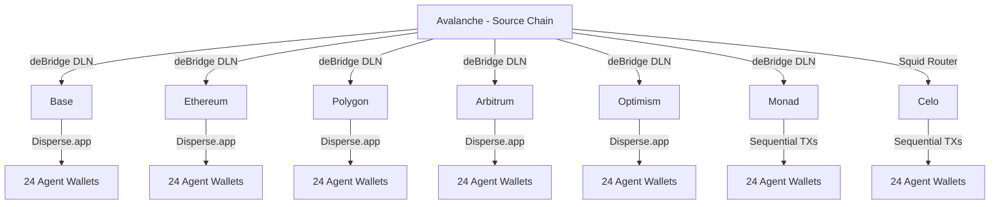

# KK V2 — Fund Distribution Operational Reference

> Complete guide for bridging, distributing, and rebalancing tokens across 8 EVM chains for the Karma Kadabra agent swarm (24 agents).

## Architecture



### Bridge Coverage

| Provider | Chains | API | Notes |
|----------|--------|-----|-------|
| **deBridge DLN** | 7/8 (all except Celo) | REST, no SDK | Cheapest, fastest. Monad chain ID = `100000030` |
| **Squid Router** | 7/8 (all except Monad) | REST, no SDK | Requires `SQUID_INTEGRATOR_ID` env var |
| **Combined** | ALL 8 | Auto-selected by `bridge-router.ts` | deBridge preferred, Squid fallback for Celo |

### Distribution Methods

| Method | Chains | TXs for 24 agents |
|--------|--------|-------------------|
| **Disperse.app** (batch) | Base, Ethereum, Polygon, Arbitrum, Avalanche, Optimism | 2-3 TXs total (approve + disperse) |
| **Sequential transfers** | Celo, Monad | 24-72 TXs (1 per agent per token) |

Disperse.app address (same on all chains): `0xD152f549545093347A162Dce210e7293f1452150`

## Facilitator Token Support Matrix

Source of truth: `https://facilitator.ultravioletadao.xyz`

| Chain | USDC | EURC | AUSD | PYUSD | USDT | Total Tokens |
|-------|------|------|------|-------|------|-------------|
| **Ethereum** | Y | Y | Y | Y | - | 4 |
| **Avalanche** | Y | Y | Y | - | - | 3 |
| **Base** | Y | Y | - | - | - | 2 |
| **Polygon** | Y | - | Y | - | - | 2 |
| **Arbitrum** | Y | - | Y | - | Y | 3 |
| **Optimism** | Y | - | - | - | Y | 2 |
| **Celo** | Y | - | - | - | Y | 2 |
| **Monad** | Y | - | Y | - | Y | 3 |

**Token addresses**: Defined in `scripts/kk/lib/chains.ts` (must match Facilitator).

### Token Summary
- **USDC**: All 8 chains
- **EURC**: Ethereum, Base, Avalanche (3 chains)
- **AUSD**: Ethereum, Polygon, Arbitrum, Avalanche, Monad (5 chains)
- **PYUSD**: Ethereum only (1 chain)
- **USDT**: Arbitrum, Optimism, Celo, Monad (4 chains)

## Wallets

### Master Wallet
| Field | Value |
|-------|-------|
| Address | `0xD3868E1eD738CED6945A574a7c769433BeD5d474` |
| Key Source | AWS SM `em/x402:PRIVATE_KEY` |
| Role | Funds all agent wallets, pays gas for bridges and distribution |

### Agent Wallets
- **24 wallets** derived from HD mnemonic (BIP-44 path `m/44'/60'/0'/0/{0..23}`)
- Mnemonic stored in AWS SM `kk/swarm-seed`
- Wallet manifest: `scripts/kk/config/wallets.json`
- Names: 6 system agents + 18 community agents

### Key Loading Pattern (Node.js wrapper for Windows compatibility)
```javascript
// NEVER show private keys in output
const { execSync } = require('child_process');
const raw = execSync(
  'aws secretsmanager get-secret-value --secret-id em/x402 --query SecretString --output text --region us-east-2',
  { encoding: 'utf8' }
);
const pk = JSON.parse(raw).PRIVATE_KEY;
execSync('npx tsx kk/<script>.ts <args>', {
  stdio: 'inherit',
  env: { ...process.env, WALLET_PRIVATE_KEY: pk, PRIVATE_KEY: pk }
});
```

## Complete Lifecycle

### Step 1: Inventory
```bash
cd scripts
npx tsx kk/check-full-inventory.ts
```
Shows: all stablecoin balances + native gas on all 8 chains + totals.

### Step 2: Plan Allocation (Optional)
```bash
npx tsx kk/generate-allocation.ts --budget 200 --output config/allocation.json
```
Generates randomized per-agent amounts with min $0.10 per agent per chain.

### Step 3: Bridge USDC from Source
```bash
# Dry run
npx tsx kk/bridge-from-source.ts --source avalanche --dry-run

# Execute (all chains from allocation)
npx tsx kk/bridge-from-source.ts --source avalanche --allocation config/allocation.json

# Or manual: specific chains + amount
npx tsx kk/bridge-from-source.ts --source avalanche --chains base,polygon --amount 20
```

### Step 4: Bridge Native Gas
```bash
# Dry run
npx tsx kk/bridge-gas.ts --dry-run

# Execute (bridges USDC → native on all chains that need gas)
npx tsx kk/bridge-gas.ts

# Specific chains
npx tsx kk/bridge-gas.ts --chains base,monad
```

### Step 5: Distribute to Agents (Fan-Out)
Run per chain. Each command distributes tokens + gas to all 24 agents.

```bash
# Uniform mode: same amount per agent
npx tsx kk/distribute-funds.ts --chain base --tokens USDC,EURC --amount 0.10 --gas 0.0002

# Allocation mode: per-agent amounts from plan
npx tsx kk/distribute-funds.ts --chain base --allocation config/allocation.json
```

**Complete distribution (all 8 chains):**
```bash
npx tsx kk/distribute-funds.ts --chain base      --tokens USDC,EURC         --amount 0.10 --gas 0.0002
npx tsx kk/distribute-funds.ts --chain ethereum   --tokens USDC,EURC,AUSD,PYUSD --amount 0.10 --gas 0.00015
npx tsx kk/distribute-funds.ts --chain polygon    --tokens USDC,AUSD         --amount 0.05 --gas 0.1
npx tsx kk/distribute-funds.ts --chain arbitrum   --tokens USDC,USDT,AUSD    --amount 0.10 --gas 0.0002
npx tsx kk/distribute-funds.ts --chain avalanche  --tokens USDC,EURC,AUSD    --amount 0.10 --gas 0.005
npx tsx kk/distribute-funds.ts --chain optimism   --tokens USDC,USDT         --amount 0.10 --gas 0.0002
npx tsx kk/distribute-funds.ts --chain celo       --tokens USDC,USDT         --amount 0.02 --gas 0.01
npx tsx kk/distribute-funds.ts --chain monad      --tokens USDC,AUSD         --amount 0.10 --gas 0.01
```

### Step 6: Verify
```bash
npx tsx kk/check-full-inventory.ts
```

### Step 7: Rebalance (if needed)
```bash
# Sweep back to master
npx tsx kk/sweep-funds.ts --target 0xD3868E1eD738CED6945A574a7c769433BeD5d474 --dry-run
npx tsx kk/sweep-funds.ts --target 0xD3868E1eD738CED6945A574a7c769433BeD5d474

# Then bridge and redistribute
```

## Budget Planning

### Cost Breakdown for $200 Budget
| Category | Estimated Cost |
|----------|---------------|
| USDC bridges (7 chains × $20 avg) | ~$140 |
| Native gas bridges (USDC → ETH/POL/etc) | ~$45-50 |
| Non-USDC stablecoins (already bridged) | ~$55 (EURC $16, AUSD $22, USDT $12, PYUSD $5) |
| Avalanche reserve | ~$10-20 |

### Per-Agent Token Targets
| Token | Amount/Agent/Chain | Purpose |
|-------|-------------------|---------|
| USDC | $0.10 - 0.20 | Main testing token |
| EURC/AUSD/PYUSD/USDT | $0.10 | Multi-token testing |
| Native gas | See gas table | TX fees |

### Gas Budget per Chain (24 agents)
| Chain | Gas/Agent | Total | ~USD | For ~N TXs/agent |
|-------|-----------|-------|------|-------------------|
| Base | 0.0002 ETH | 0.005 ETH | $12 | ~500 TXs |
| Ethereum | 0.00015 ETH | 0.004 ETH | $10 | ~20 TXs |
| Polygon | 0.1 POL | 3.0 POL | $1.50 | ~1000 TXs |
| Arbitrum | 0.0002 ETH | 0.005 ETH | $12 | ~500 TXs |
| Avalanche | 0.005 AVAX | 0.12 AVAX | $3 | ~200 TXs |
| Optimism | 0.0002 ETH | 0.005 ETH | $12 | ~500 TXs |
| Celo | 0.01 CELO | 0.30 CELO | $0.15 | ~500 TXs |
| Monad | 0.01 MON | 0.30 MON | $0.50 | ~500 TXs |

## Inventory Snapshot — 2026-02-22

### Master Wallet (`0xD386...`)
| Chain | Native | USDC | EURC | AUSD | PYUSD | USDT |
|-------|--------|------|------|------|-------|------|
| Base | 0.0014 ETH | $30.55 | $3.08 | - | - | - |
| Ethereum | 0.0065 ETH | $2.64 | $3.08 | $4.00 | $5.09 | - |
| Polygon | 14.23 POL | $1.22 | - | $6.07 | - | - |
| Arbitrum | 0.0081 ETH | $24.80 | - | $0 | - | $6.09 |
| Avalanche | 0.19 AVAX | $42.22 | $10.12 | $6.09 | - | - |
| Optimism | 0.0081 ETH | $26.27 | - | - | - | $0 |
| Celo | 0 CELO | $0.69 | - | - | - | $6.10 |
| Monad | 24.58 MON | $41.37 | - | $6.08 | - | - |

**Totals**: USDC $169.77 | EURC $16.27 | AUSD $22.25 | PYUSD $5.09 | USDT $12.19 | **Grand: ~$225.57**

### Known Gaps
- **Optimism USDT**: $0 — needs bridge or swap
- **Monad USDT**: Facilitator supports it, not yet in `chains.ts`
- **Arbitrum AUSD**: $0 — bridge failed or never attempted
- **Celo gas**: 0 CELO — blocked (no deBridge, needs Squid integrator ID)
- **Base gas**: Low (0.0014 ETH) — already distributed to 24 agents
- **Monad excess**: $41 USDC + $6 AUSD + 24 MON — more than needed (double-bridged)

## Troubleshooting

### Import Order Issue (dotenv + chains.ts)
`chains.ts` evaluates `rpc()` at module-load time. If `.env.local` isn't loaded before import, private RPCs won't be used.

**Correct** (bridge-gas.ts pattern):
```typescript
// Load .env.local FIRST
import { config } from "dotenv";
config({ path: resolve(__dirname, "../../.env.local") });
// THEN import chains
import { CHAINS } from "./lib/chains.js";
```

### deBridge Approve Buffer
deBridge execution fee varies between quote and TX time. Always add 2% buffer:
```typescript
const rawApprove = BigInt(quote.estimation?.srcChainTokenIn?.amount);
const approveAmount = rawApprove + (rawApprove * 2n) / 100n;
```

### Windows Shell Issues
If `echo`, `export` fail in Git Bash, use the Node.js wrapper pattern (see Key Loading Pattern above).

### Decimal JSON Serialization
Python `Decimal` types crash JSON serialization. Use `_sanitize_for_json()` (fixed in 2026-02-21).

### Escrow DB UPSERT Race Condition
At assignment, escrow INSERT may fail if row exists from a previous attempt. Use INSERT fallback when UPDATE matches 0 rows (fixed in 2026-02-21).

## Script Reference

| Script | Input | Output |
|--------|-------|--------|
| `check-full-inventory.ts` | `WALLET_PRIVATE_KEY` | Console: all balances |
| `check-all-balances.ts` | `WALLET_PRIVATE_KEY` | Console: native + USDC |
| `bridge-from-source.ts` | `--source`, `--chains`, `--amount` or `--allocation` | Console + JSON report |
| `bridge-gas.ts` | `--dry-run`, `--chains` | Console: bridge quotes/results |
| `distribute-funds.ts` | `--chain`, `--tokens`, `--amount`, `--gas` or `--allocation` | Console + JSON report in `scripts/kk/` |
| `generate-allocation.ts` | `--budget`, `--output`, `--seed` | JSON allocation file |
| `sweep-funds.ts` | `--target`, `--chains`, `--dry-run`, `--tokens-only` | Console: sweep results |
| `generate-wallets.ts` | AWS SM `kk/swarm-seed` | `config/wallets.json` |

All scripts generate timestamped JSON reports: `scripts/kk/report-<action>-<chain>-<timestamp>.json`
