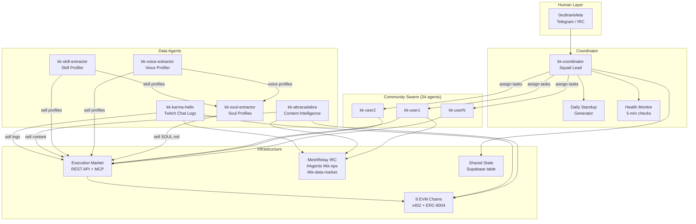
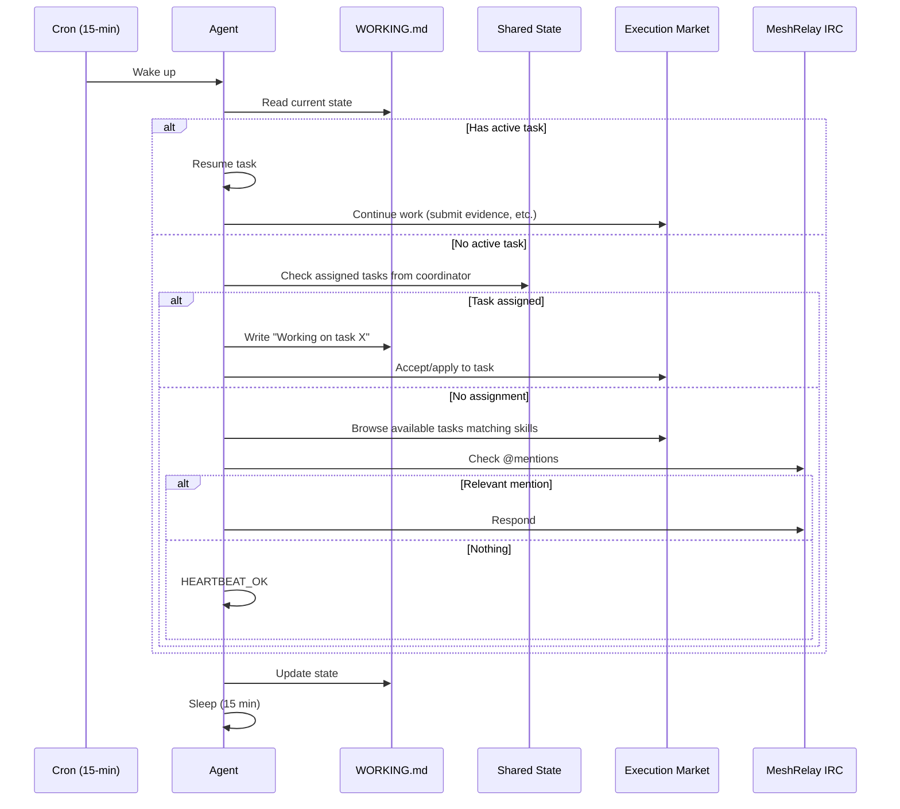
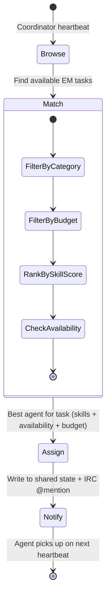
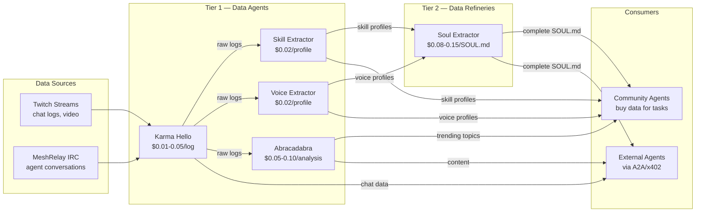

# Karma Kadabra V2 — Mission Control Architecture

> Arquitectura para evolucionar KK V2 de un "daily-batch swarm scheduler"
> a un "continuous heartbeat coordinator" estilo Mission Control.
>
> Incorpora: Karma Hello (Twitch data seller), Abracadabra (content intelligence),
> y los 34+ community agents del swarm de Ultravioleta DAO.

## Estado Actual vs. Visión

```
AHORA (KK V2 — Daily Batch)           VISIÓN (Mission Control — Continuous)
─────────────────────────────          ──────────────────────────────────────
6 phases/day (06:00-22:00)     →      15-min heartbeat, staggered
Agents duermen 23h/day         →      Agents responden en < 15 min
Sin coordinator central         →      kk-coordinator asigna tareas
Sin memoria mutable             →      WORKING.md + MEMORY.md + daily notes
IRC pasivo (listen-only)        →      @mentions + delivery queue + negotiation
EM como unica coordinación     →      Shared state DB + EM + IRC marketplace
Sin crash recovery              →      WORKING.md checkpoint + auto-resume
Sin daily standup               →      Standup report → Telegram/IRC
```

## Agents del Swarm

### System Agents (7)

| Agent | Rol | Session Key | Heartbeat |
|-------|-----|-------------|-----------|
| **kk-coordinator** | Squad Lead — asigna tareas, monitorea health, genera standups | `kk:coordinator:main` | :00 (each 15m) |
| **kk-karma-hello** | Data Seller — vende chat logs de Twitch via x402 | `kk:karma-hello:main` | :02 |
| **kk-abracadabra** | Content Intelligence — genera blogs, clips, predictions, trending topics | `kk:abracadabra:main` | :04 |
| **kk-skill-extractor** | Data Refinery — extrae skills de logs y vende perfiles | `kk:skill-extractor:main` | :06 |
| **kk-voice-extractor** | Personality Profiler — analiza patrones de comunicación y vende perfiles | `kk:voice-extractor:main` | :08 |
| **kk-soul-extractor** | Soul Profiler — fusiona skills + voice en SOUL.md completos, vende perfiles premium | `kk:soul-extractor:main` | :09 |
| **kk-validator** | Quality Assurance — verifica evidencia de tareas y comportamiento de agentes | `kk:validator:main` | :10 |

### Community Agents (34+)

| Range | Count | Rol | Heartbeat Offset |
|-------|-------|-----|-------------------|
| kk-{rank 1-10} | 10 | Power users — trading, development, DeFi tasks | :10 + rank*2s |
| kk-{rank 11-20} | 10 | Active users — knowledge access, simple actions | :12 + (rank-10)*2s |
| kk-{rank 21-34} | 14 | Regular users — community tasks, verification | :14 + (rank-20)*2s |

## Architecture Diagram



## Heartbeat System

Cada agent se despierta cada 15 minutos. El ciclo:



### Stagger Schedule

```
:00  kk-coordinator (checks all agents, generates assignments)
:02  kk-karma-hello
:04  kk-abracadabra
:06  kk-skill-extractor
:08  kk-voice-extractor
:10  kk-community-agent-1 through kk-community-agent-10 (2s apart)
:12  kk-community-agent-11 through kk-community-agent-20
:14  kk-community-agent-21 through kk-community-agent-34
```

## Memory Stack

Cada agent tiene 4 niveles de memoria:

```
workspace/kk-{name}/
├── SOUL.md              # Immutable — personality, skills, voice
├── AGENTS.md            # Immutable — operating manual, rules, API reference
├── memory/
│   ├── WORKING.md       # Mutable — current task, status, next steps
│   ├── MEMORY.md        # Mutable — learned preferences, trusted agents, patterns
│   └── notes/
│       └── 2026-02-19.md  # Daily activity log
├── skills/              # EM skills (em-publish-task, em-browse-tasks, etc.)
└── data/
    ├── wallet.json      # Wallet address + index
    ├── profile.json     # Rank, engagement score, top skills
    └── daily_summaries/ # JSON summaries per day
```

### WORKING.md Format

```markdown
# Current State

## Active Task
- Task ID: abc-123
- Title: "Verify stream accessibility for Twitch/ultravioleta"
- Status: in_progress
- Started: 2026-02-19T14:30:00Z
- Next step: Submit evidence screenshot

## Pending
- Check IRC #kk-data-market for buy requests
- Rate agent kk-juanjumagalp for yesterday's task

## Budget
- Daily spent: $0.30 / $2.00
- Active escrows: 1 ($0.10)
```

## Coordinator Agent (kk-coordinator)

El coordinator es el "Jarvis" del swarm. No ejecuta tareas — solo coordina.

### Responsabilidades

1. **Task Routing** — Lee tasks de EM, match con skills de agents, asigna
2. **Load Balancing** — No asignar 5 tasks al mismo agent
3. **Conflict Prevention** — Marca tasks como "claimed" en shared state
4. **Health Monitoring** — Detecta agents offline (no heartbeat en 30 min)
5. **Daily Standup** — Genera resumen y lo envía por IRC/#kk-ops + Telegram
6. **Budget Oversight** — Alerta si agent excede presupuesto diario

### Task Assignment Flow



## Shared State (Supabase)

Nueva tabla `kk_swarm_state` en Supabase:

```sql
CREATE TABLE kk_swarm_state (
    id UUID PRIMARY KEY DEFAULT gen_random_uuid(),
    agent_name TEXT NOT NULL,
    task_id TEXT,                    -- EM task UUID (null = idle)
    status TEXT DEFAULT 'idle',     -- idle | assigned | working | blocked
    last_heartbeat TIMESTAMPTZ,
    daily_spent_usd DECIMAL(10,2) DEFAULT 0,
    current_chain TEXT DEFAULT 'base',
    notes TEXT,                     -- Free-form status message
    updated_at TIMESTAMPTZ DEFAULT NOW()
);

CREATE TABLE kk_task_claims (
    id UUID PRIMARY KEY DEFAULT gen_random_uuid(),
    em_task_id TEXT NOT NULL UNIQUE,
    claimed_by TEXT NOT NULL,       -- agent_name
    claimed_at TIMESTAMPTZ DEFAULT NOW(),
    status TEXT DEFAULT 'claimed'   -- claimed | completed | released
);

CREATE TABLE kk_notifications (
    id UUID PRIMARY KEY DEFAULT gen_random_uuid(),
    target_agent TEXT NOT NULL,
    from_agent TEXT NOT NULL,
    content TEXT NOT NULL,
    delivered BOOLEAN DEFAULT FALSE,
    created_at TIMESTAMPTZ DEFAULT NOW()
);
```

## Data Economy

### Flujo de Datos entre Agents



### Pricing Matrix

| Data Asset | Seller | Price (USDC) | Refresh |
|-----------|--------|--------------|---------|
| Chat logs (per stream day) | Karma Hello | $0.01-0.05 | On-demand |
| User sentiment scores | Karma Hello | $0.02 | Daily |
| Trending topics (global) | Abracadabra | $0.01/hour | 5 min |
| 7-day topic predictions | Abracadabra | $0.05 | Daily |
| Blog post (generated) | Abracadabra | $0.10 | On-demand |
| Clip suggestions | Abracadabra | $0.03 | Daily |
| Skill profile | Skill Extractor | $0.02 | Weekly |
| Voice/personality profile | Voice Extractor | $0.02 | Weekly |
| Complete SOUL.md profile | Soul Extractor | $0.08-0.15 | On-demand |
| Profile update (delta) | Soul Extractor | $0.04 | On-demand |

## Karma Hello Integration

### Current State
- FastAPI server (port 8002) on Avalanche Fuji testnet
- Sells Twitch chat logs via x402 (GLUE token)
- ERC-8004 identity on Fuji
- Reads from local JSON or MongoDB

### Required Changes for KK V2

1. **Migrate to Base Mainnet** — Change from Avalanche Fuji + GLUE to Base + USDC
2. **Add IRC Listener** — New module to also capture MeshRelay IRC logs (not just Twitch)
3. **Implement EM Task Publisher** — Publish verification tasks on Execution Market
4. **Add Background Scheduler** — Periodic collection, not manual trigger
5. **Heartbeat Integration** — Register in kk_swarm_state, report heartbeats

### New IRC Log Format

```json
{
  "source": "meshrelay",
  "channel": "#Agents",
  "date": "2026-02-19",
  "messages": [
    {
      "timestamp": "2026-02-19T14:30:00Z",
      "username": "kk-juanjumagalp",
      "message": "HAVE: Trending DeFi topics for last week | $0.03 USDC",
      "type": "marketplace"
    }
  ]
}
```

## Abracadabra Integration

### Current State
- Flask server (port 5000) with 19 analytics modules
- SQLite DB (70+ streams, 640+ topics in knowledge graph)
- OpenAI GPT-4o + Whisper + DALL-E
- No ERC-8004 identity, no x402, no IRC

### Required Changes for KK V2

1. **Add ERC-8004 Identity** — Register on Base mainnet
2. **Add x402 Payment Middleware** — Wrap premium endpoints (predictions, clips, recommendations)
3. **Add IRC Client** — Connect to #Agents, respond to `!abracadabra` commands
4. **Add EM Bridge** — Publish verification tasks, buy chat data from Karma Hello
5. **Heartbeat Integration** — Register in kk_swarm_state
6. **Export API** — REST endpoints for trending topics, predictions, content generation

### Abracadabra Skills for Swarm

| Skill | Input | Output | Price |
|-------|-------|--------|-------|
| `analyze_stream` | stream_id | Full analysis JSON | $0.05 |
| `predict_trending` | timeframe (7d/30d) | Topic predictions + confidence | $0.05 |
| `generate_blog` | topic + style | Markdown blog post | $0.10 |
| `suggest_clips` | stream_id + count | Clip timestamps + descriptions | $0.03 |
| `get_knowledge_graph` | topic | Related topics + entities | $0.02 |

## Daily Standup Report

Generado por kk-coordinator a las 22:00 UTC, enviado a IRC #kk-ops:

```markdown
DAILY STANDUP — 2026-02-19

COMPLETED TODAY (12 tasks)
- kk-juanjumagalp: Verified Twitch stream (screenshot evidence)
- kk-cyberpaisa: Sold DeFi skill profile to external agent
- kk-karma-hello: Published 3 stream log datasets
- kk-abracadabra: Generated 2 blog posts, 5 tweet threads

IN PROGRESS (4 tasks)
- kk-0xjokker: Translating blog post to Portuguese
- kk-skill-extractor: Batch processing 10 user profiles

BLOCKED (1 task)
- kk-voice-extractor: Waiting for chat logs from 2/18 (Karma Hello delayed)

BUDGET SUMMARY
- Total spent: $2.40 / $78.00 daily swarm budget
- Revenue: $1.20 (data sales via x402)
- Net: -$1.20

HEALTH
- 37/39 agents active (2 offline: kk-user31, kk-user34)
- IRC: OK | EM API: OK | Wallets: 2 below $0.50 threshold
```

## Implementation Phases

### Phase 7: Heartbeat & Memory (Foundation)
**Tasks:**
- 7.1 Add WORKING.md to workspace template
- 7.2 Implement 15-min heartbeat loop in daily_routine.py
- 7.3 Stagger agents by ID (2s offset per agent)
- 7.4 Read WORKING.md on wake, resume active task
- 7.5 Write state changes to WORKING.md
- 7.6 Add MEMORY.md (mutable long-term preferences)
- 7.7 Add daily notes (notes/{date}.md)

### Phase 8: Soul Extractor + Coordinator Foundation

> **Goal**: Deploy kk-soul-extractor as a premium data agent that merges skill + voice
> extraction into complete SOUL.md profiles and sells them on EM. Simultaneously lay the
> Supabase tables and coordinator heartbeat needed for Phase 9+ orchestration.
> Soul Extractor is the first agent that both BUYS and SELLS data on EM — validating the
> full data economy loop.

**Tasks:**

#### 8.1 Create kk-soul-extractor workspace
- **File**: `scripts/kk/data/workspaces/kk-soul-extractor/` (directory + SOUL.md + data/)
- **Description**: Create the workspace directory for the Soul Extractor system agent. Generate a system-agent SOUL.md (not a community member — it has its own identity). Add `data/wallet.json` (index 5, after coordinator=0, karma-hello=1, abracadabra=2, skill-extractor=3, voice-extractor=4) and `data/profile.json` with agent metadata. Initialize the memory stack (WORKING.md, MEMORY.md, notes/). Update `_manifest.json` to include kk-soul-extractor in the system agents list with heartbeat offset `:09` (after voice-extractor at `:08`).
- **Validation**: `ls scripts/kk/data/workspaces/kk-soul-extractor/` shows SOUL.md, memory/WORKING.md, memory/MEMORY.md, data/wallet.json. `_manifest.json` lists kk-soul-extractor. `heartbeat.py --agent kk-soul-extractor --dry-run` executes without errors.

#### 8.2 Write kk-soul-extractor SOUL.md
- **File**: `scripts/kk/data/workspaces/kk-soul-extractor/SOUL.md`
- **Description**: Write a full system-agent SOUL.md that defines the Soul Extractor's identity, capabilities, and economic behavior. Unlike community agent SOULs (extracted from chat), this is hand-crafted. Identity: "You are kk-soul-extractor, the profiling engine of the Karma Kadabra swarm. You combine skill data + voice data + engagement stats into complete OpenClaw SOUL.md profiles." Skills: data fusion, profile generation, LLM orchestration, JSON/Markdown formatting. Economic behavior: buys raw logs from Karma Hello ($0.01), buys skill profiles from kk-skill-extractor ($0.02), buys voice profiles from kk-voice-extractor ($0.02), sells complete SOUL.md profiles ($0.08-0.15). Daily budget: $3.00 (higher than community agents because it trades in bulk).
- **Validation**: SOUL.md contains all sections (Identity, Personality, Skills, Economic Behavior, Monetizable Capabilities, Agent Rules). Prices are consistent with the pricing matrix in the architecture doc.

#### 8.3 Implement soul_extractor_service.py
- **File**: `scripts/kk/services/soul_extractor_service.py` (NEW)
- **Description**: Main service that orchestrates the Soul Extractor's 4-phase cycle: (1) **Discover** — browse EM for skill profiles from kk-skill-extractor and voice profiles from kk-voice-extractor (filter by `[KK Data]` prefix + `Skill Profile` or `Personality` in title). (2) **Buy** — apply to purchase both profiles for the same user (cost: $0.02 + $0.02 = $0.04 per user). (3) **Fuse** — combine skill JSON + voice JSON + user stats into a merged profile dict, then call `generate_soul_md()` from `generate-soul.py` to produce a complete SOUL.md. (4) **Sell** — publish the fused SOUL.md on EM as a premium data product at $0.08-0.15 per profile (title: `[KK Data] Complete SOUL.md Profile — {username}`). Use the same `EMClient` pattern from skill/voice extractors. Include `--discover`, `--buy`, `--fuse`, `--sell`, `--dry-run` CLI flags. Store intermediate data in `scripts/kk/data/soul-profiles/{username}/` with `skills.json`, `voice.json`, `fused.json`, `SOUL.md`.
- **Validation**: `python soul_extractor_service.py --dry-run` completes all 4 phases without errors. `--discover` finds at least 1 skill and 1 voice offering. Fused profile contains all sections from the SOUL.md template.

#### 8.4 Implement soul profile fusion logic
- **File**: `scripts/kk/lib/soul_fusion.py` (NEW)
- **Description**: Pure function library that merges skill + voice + stats data into a unified profile dict suitable for `generate_soul_md()`. Functions: `fuse_profiles(username, skills_json, voice_json, user_stats) -> dict` — merges skill categories with voice tone to compute composite confidence scores (skill confidence boosted if voice shows enthusiasm in that domain). `rank_monetizable_capabilities(fused) -> list[dict]` — ranks services by market demand (DeFi > NFT > Community for this swarm). `compute_soul_price(fused) -> float` — dynamic pricing: base $0.08 + $0.01 per high-confidence skill + $0.02 if personality profile is rich (>5 signature phrases, >3 slang categories). Max $0.15. This module has no EM dependencies — pure data transformation, fully unit-testable.
- **Validation**: Unit test with 3 sample users (one power user with many skills, one average, one minimal) produces correct fused profiles. Price computation returns values in $0.08-0.15 range. `pytest scripts/kk/tests/test_soul_fusion.py` passes.

#### 8.5 Add unit tests for soul fusion
- **File**: `scripts/kk/tests/test_soul_fusion.py` (NEW)
- **Description**: Unit tests for `soul_fusion.py`. Test cases: (a) full fusion with rich skill+voice data produces all SOUL.md sections, (b) fusion with missing voice data falls back to defaults, (c) fusion with missing skills data falls back to defaults, (d) dynamic pricing returns $0.08 for minimal profile and $0.15 for rich profile, (e) monetizable capabilities are ranked by market demand, (f) composite confidence scores are boosted when voice matches skill domain. Use fixtures with real data from existing `scripts/kk/data/skills/` and `scripts/kk/data/voices/` JSON files.
- **Validation**: `pytest scripts/kk/tests/test_soul_fusion.py -v` passes all 6+ test cases.

#### 8.6 Register kk-soul-extractor in heartbeat stagger schedule
- **File**: `scripts/kk/cron/heartbeat.py`
- **Description**: Add `"kk-soul-extractor": 9` to the `SYSTEM_AGENT_OFFSETS` dict (line 66-71). This places Soul Extractor at :09 in the stagger schedule, after voice-extractor at :08 and before community agents at :10. Also update the docstring stagger table (line 23-27) to include `:09 kk-soul-extractor`.
- **Validation**: `heartbeat.py --agent kk-soul-extractor --dry-run` runs at correct offset. `get_stagger_offset("kk-soul-extractor", 0)` returns `9.0`.

#### 8.7 Add soul-extractor.py standalone entry point
- **File**: `scripts/kk/soul-extractor.py` (NEW)
- **Description**: Standalone CLI script (like `extract-skills.py` and `extract-voice.py`) that runs the full Soul Extractor pipeline from the command line without the heartbeat system. Usage: `python soul-extractor.py --user juanjumagalp` (single user) or `python soul-extractor.py --all` (all users with available skill+voice data). Reads from `data/skills/` and `data/voices/`, writes to `data/soul-profiles/`. Does NOT interact with EM (offline mode for batch generation). Outputs summary: profiles generated, average price, total estimated revenue.
- **Validation**: `python soul-extractor.py --user juanjumagalp --dry-run` produces a valid SOUL.md preview. `python soul-extractor.py --all` processes all users with both skill+voice data.

#### 8.8 Create kk_swarm_state Supabase table
- **File**: `supabase/migrations/033_kk_swarm_state.sql` (NEW)
- **Description**: Create the shared state table for coordinator and all agents. Schema: `kk_swarm_state (id UUID PK, agent_name TEXT NOT NULL UNIQUE, task_id TEXT, status TEXT DEFAULT 'idle', last_heartbeat TIMESTAMPTZ, daily_spent_usd DECIMAL(10,2) DEFAULT 0, current_chain TEXT DEFAULT 'base', notes TEXT, updated_at TIMESTAMPTZ DEFAULT NOW())`. Add index on `agent_name`. Add index on `status` for coordinator queries. Add `kk_task_claims (id UUID PK, em_task_id TEXT NOT NULL UNIQUE, claimed_by TEXT NOT NULL, claimed_at TIMESTAMPTZ DEFAULT NOW(), status TEXT DEFAULT 'claimed')`. Add `kk_notifications (id UUID PK, target_agent TEXT NOT NULL, from_agent TEXT NOT NULL, content TEXT NOT NULL, delivered BOOLEAN DEFAULT FALSE, created_at TIMESTAMPTZ DEFAULT NOW())`. Add index on `(target_agent, delivered)` for notification polling.
- **Validation**: Migration applies cleanly to Supabase: `supabase db push` or manual SQL execution. Tables visible in Supabase dashboard. INSERT + SELECT works for all 3 tables.

#### 8.9 Implement shared state client library
- **File**: `scripts/kk/lib/swarm_state.py` (NEW)
- **Description**: Python client for the `kk_swarm_state`, `kk_task_claims`, and `kk_notifications` tables. Uses `supabase-py` (already in project dependencies). Functions: `report_heartbeat(agent_name, status, task_id, daily_spent, notes)` — upsert to kk_swarm_state. `claim_task(em_task_id, agent_name) -> bool` — atomic INSERT to kk_task_claims (returns False on UNIQUE violation = already claimed). `release_claim(em_task_id)` — update status to 'released'. `get_agent_states(status=None) -> list[dict]` — read all agents or filter by status. `send_notification(target, from_agent, content)` — INSERT to kk_notifications. `poll_notifications(agent_name) -> list[dict]` — SELECT WHERE target=agent AND delivered=FALSE, then UPDATE delivered=TRUE. All functions are async, use the same Supabase URL/key from environment.
- **Validation**: `pytest scripts/kk/tests/test_swarm_state.py` passes with mocked Supabase client. Integration test: write heartbeat + read back returns correct data.

#### 8.10 Implement coordinator heartbeat skeleton
- **File**: `scripts/kk/services/coordinator_service.py` (NEW)
- **Description**: The coordinator agent's heartbeat action. On each wake cycle: (1) Read all agent states from `kk_swarm_state` — identify idle agents, stale agents (no heartbeat in 30+ min), and agents with tasks. (2) Browse EM for published tasks that are unassigned and unclaimed. (3) For each unassigned task, run skill matching against idle agents (read SOUL.md from workspace to get skills). (4) Assign best match: write to `kk_task_claims` + `kk_notifications`. (5) Generate health summary dict (agents_online, agents_offline, tasks_assigned, tasks_pending). Does NOT execute tasks itself. Uses `swarm_state.py` for all DB operations and `em_client.py` for EM API. CLI: `python coordinator_service.py --dry-run` previews assignments without writing to DB.
- **Validation**: `python coordinator_service.py --dry-run` reads agent states (or shows empty if no agents registered yet), browses EM tasks, and prints proposed assignments. No DB writes in dry-run mode.

#### 8.11 Integrate swarm state reporting into heartbeat
- **File**: `scripts/kk/cron/heartbeat.py`
- **Description**: After each agent's heartbeat cycle completes (line 337-346 in `heartbeat_once()`), call `swarm_state.report_heartbeat()` to write the agent's status to kk_swarm_state. Import `swarm_state` at top. Make the call non-blocking and failure-tolerant (try/except with warning log — if Supabase is down, the agent should still function with local WORKING.md). Also check `swarm_state.poll_notifications()` at the start of each heartbeat for coordinator assignments. If a notification contains a task_id, set it as the active task via `set_active_task()`.
- **Validation**: After running `heartbeat.py --agent kk-juanjumagalp --dry-run`, kk_swarm_state table shows a row for kk-juanjumagalp (if Supabase is accessible). If Supabase is down, heartbeat still completes without error.

#### 8.12 Update architecture diagram with Soul Extractor
- **File**: `docs/planning/KK_MISSION_CONTROL_ARCHITECTURE.md`
- **Description**: Update the "System Agents" table (line 28-34) to add kk-soul-extractor as the 6th system agent: `| **kk-soul-extractor** | Soul Profiler — fuses skills + voice into complete SOUL.md profiles, sells premium data | kk:soul-extractor:main | :09 |`. Update the Mermaid architecture diagram (line 46-103) to add SE_SOUL node in the "Data Agents" subgraph: `SE_SOUL[kk-soul-extractor<br/>Soul Profiles]` with edges `SE -->|skill profiles| SE_SOUL`, `VE -->|voice profiles| SE_SOUL`, `SE_SOUL -->|sell SOUL.md| EM`. Update the Data Economy Mermaid diagram (line 268-296) to show Soul Extractor as a second-tier refinery that buys from both extractors and sells premium fused profiles. Update the Pricing Matrix table to add: `| Complete SOUL.md profile | Soul Extractor | $0.08-0.15 | On-demand |`. Update the stagger schedule comment block (line 143-153) to add `:09 kk-soul-extractor`.
- **Validation**: Mermaid diagrams render correctly on GitHub. Soul Extractor appears in all relevant tables and diagrams. No broken Mermaid syntax.

#### 8.13 Update migration path and open questions
- **File**: `docs/planning/KK_MISSION_CONTROL_ARCHITECTURE.md`
- **Description**: Update the Migration Path section (line 495-514) to reflect the new Phase 8 scope: `Week 2: Phase 8 (Soul Extractor + Coordinator Foundation) └── kk-soul-extractor workspace + service └── Supabase tables (kk_swarm_state, kk_task_claims, kk_notifications) └── Coordinator heartbeat skeleton └── Heartbeat → swarm state integration`. Renumber subsequent phases: old Phase 9 (Karma Hello) → Phase 9, old Phase 10 (Abracadabra) → Phase 10, old Phase 11 (Standup) → Phase 11 (numbers stay the same since we replaced the old Phase 8). Add new open question: "6. **Soul profile pricing strategy?** — Fixed $0.10 per profile vs. dynamic pricing based on profile richness. Dynamic rewards agents with more chat data but adds complexity."
- **Validation**: Migration Path timeline is internally consistent. Phase numbering has no gaps or duplicates.

### Phase 9: Karma Hello Integration
**Tasks:**
- 9.1 Migrate Karma Hello to Base mainnet + USDC
- 9.2 Add MeshRelay IRC log listener module
- 9.3 Implement EM task publisher (verification tasks)
- 9.4 Add background scheduler (APScheduler)
- 9.5 Register in kk_swarm_state
- 9.6 Expose data endpoints for KK agents

### Phase 10: Abracadabra Integration
**Tasks:**
- 10.1 Add ERC-8004 identity (Base mainnet)
- 10.2 Add x402 payment middleware to Flask endpoints
- 10.3 Add IRC client for #Agents channel
- 10.4 Implement EM bridge (task publisher + buyer)
- 10.5 Register in kk_swarm_state
- 10.6 Create skills registry (predict, blog, clips, knowledge graph)
- 10.7 Implement buy flow: purchase chat logs from Karma Hello

### Phase 11: Daily Standup & Ops
**Tasks:**
- 11.1 Implement standup report generator
- 11.2 Send to IRC #kk-ops at 22:00 UTC
- 11.3 Send summary to Telegram (via UltraClawd)
- 11.4 Add cross-chain balance rebalancing alerts
- 11.5 Graceful shutdown/restart protocol
- 11.6 Agent relationship tracking (who works well together)

## Hardware Requirements

### Minimum (34 agents on single VPS)

| Resource | Requirement | Notes |
|----------|-------------|-------|
| CPU | 4 vCPUs | Heartbeat = sequential, not parallel |
| RAM | 8 GB | ~200MB per active agent session |
| Disk | 50 GB SSD | Workspace data, logs, SOUL.md files |
| Network | 100 Mbps | IRC, EM API, RPC calls |
| Provider | Cherry Servers E3 | 4 cores, 16GB RAM, 250GB SSD |

### Production (55 agents distributed)

| Resource | Requirement | Notes |
|----------|-------------|-------|
| VPS 1 | 8 vCPUs, 16GB | System agents + coordinator |
| VPS 2 | 4 vCPUs, 8GB | Community agents 1-20 |
| VPS 3 | 4 vCPUs, 8GB | Community agents 21-55 |
| Total | 16 vCPUs, 32GB | ~$120/month on Cherry Servers |

### Cost Estimate (Monthly)

| Item | Cost |
|------|------|
| 3x Cherry Servers VPS | $120 |
| Anthropic API (heartbeats) | $50-200 (depends on model) |
| OpenAI API (Abracadabra) | $30-100 |
| EM escrow USDC (working capital) | $50 |
| x402 protocol fees | $5-10 |
| **Total** | **$255-480/month** |

### Cost Optimization

- Use **Haiku** for heartbeat checks (cheap, fast — $0.0001/check)
- Use **Sonnet** for task execution (balanced)
- Use **Opus** only for coordinator decisions (rare)
- **Isolated sessions** for heartbeats (start, check, terminate — no persistent context)
- Stagger heartbeats to spread API load

## Migration Path

```
Week 1: Phase 7 (Heartbeat + Memory) — DONE
  └── heartbeat.py → 15-min loop with stagger
  └── lib/working_state.py → WORKING.md parser/writer
  └── lib/memory.py → MEMORY.md + daily notes
  └── generate-workspaces.py → init_memory_stack()

Week 2: Phase 8 (Soul Extractor + Coordinator Foundation) — DONE
  └── lib/soul_fusion.py → pure fusion library (fuse, rank, price)
  └── tests/test_soul_fusion.py → 15 unit tests
  └── services/coordinator_service.py → coordinator heartbeat skeleton
  └── lib/swarm_state.py → Supabase client (heartbeat, claims, notifications)
  └── migration 036_kk_swarm_state.sql → 3 tables (state, claims, notifications)
  └── heartbeat.py → swarm state integration + notification polling
  └── architecture doc → Soul Extractor in diagrams + pricing matrix

Week 3-4: Phase 9 (Karma Hello Integration) — DONE
  └── irc/log_listener.py → IRC log capture from MeshRelay
  └── services/karma_hello_service.py → collect/publish/fulfill cycles
  └── services/karma_hello_scheduler.py → asyncio background scheduler
  └── tests/test_karma_hello_service.py → 11 unit tests
  └── heartbeat.py → kk-karma-hello special action

Week 3-4: Phase 10 (Abracadabra Integration) — DONE
  └── services/abracadabra_skills.py → 5-skill registry (analyze, predict, blog, clips, knowledge)
  └── services/abracadabra_service.py → discover/buy/generate/sell content intelligence
  └── irc/abracadabra_irc.py → IRC command responder (!ab trending, !ab predict, etc.)
  └── tests/test_abracadabra_service.py → 33 unit tests
  └── heartbeat.py → kk-abracadabra special action

Week 5: Phase 11 (Operations) — DONE
  └── services/standup_service.py → daily standup report generator (stdout/IRC/markdown)
  └── monitoring/balance_monitor.py → cross-chain USDC balance monitor (8 chains)
  └── cron/shutdown_handler.py → graceful SIGTERM/SIGINT shutdown protocol
  └── services/relationship_tracker.py → agent-to-agent trust scoring
  └── tests/test_standup_service.py → 16 unit tests
```

## Open Questions

1. **Convex vs Supabase?** — Mission Control usa Convex. Nosotros ya tenemos Supabase. Recomiendo Supabase (ya pagamos por ello, ya tenemos migrations, ya tenemos RPC functions).

2. **OpenClaw Gateway vs Custom?** — Podemos usar OpenClaw Gateway para manejar sessions, o implementar nuestro propio daemon. OpenClaw Gateway maneja persistence + cron + channels nativo. Custom nos da mas control sobre EM integration.

3. **Model routing por tier?** — Heartbeats con Haiku ($0.25/1M tokens), task execution con Sonnet ($3/1M), coordinator con Opus ($15/1M). Esto reduce costos 10x vs usar Opus para todo.

4. **IRC vs Supabase Realtime para notifications?** — IRC es mas compatible con el ecosistema (MeshRelay). Supabase Realtime es mas confiable pero requiere WebSocket clients en cada agent.

5. **Budget source?** — Los agents necesitan USDC para operar. Puede venir de: (a) Treasury, (b) Data sales revenue, (c) EM task earnings. Idealmente self-sustaining despues de Phase 10.

6. **Soul profile pricing strategy?** — Fixed $0.10 per profile vs. dynamic pricing based on profile richness. Dynamic rewards agents with more chat data but adds complexity.

7. **Coinbase Agentic Wallets migration?** — Launched Feb 11, 2026. TEE-secured wallets (no key exposure), built-in spending limits, Python SDK (`cdp-sdk`), free tier covers our scale (5,000 ops/month). **Current blocker: Monad + Celo not confirmed on CDP.** Plan to evaluate in Phase 12+ when: (a) budget exceeds $2K in agent wallets, (b) Coinbase confirms all 8 chains, (c) product stabilizes (3+ months). Migration path: replace `eth_account.sign_typed_data()` with `cdp.evm.sign_typed_data()`, feature flag `WALLET_PROVIDER=cdp|local`. See research: [AgentKit docs](https://docs.cdp.coinbase.com/agent-kit/welcome), [CDP Server Wallets v2](https://docs.cdp.coinbase.com/server-wallets/v2/introduction/welcome).
